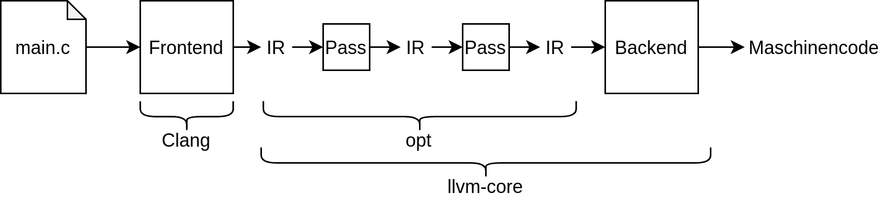

<!-- TODO: Darstellung von CFGs zwischen Basic Blocks? -->
<!-- TODO: LLVM IR Hierarchie (Module, Funktionen, Basic Blocks)? -->


# Motivation

Es ist ein neuer Prozessor entwickelt worden mit einem neuen Befehlssatz, und es
sollen für zwei Programmiersprachen Compiler entwickelt werden, die diesen Befehlssatz
als Ziel haben.
Was tun?


## Themen für heute: Letzte Phase in Compiler-Pipeline

\


# LLVM - die Idee


## Was ist das Ziel von LLVM?

LLVM ist ein Open-Source-Framework, welches die
modulare Entwicklung von Compilern und ähnlichen sprachorientierten Programmen
ermöglicht. Kernstücke sind LLVM IR (eine streng typisierte Zwischensprache), ein
flexibel konfigurierbarer Optimierer, der zur Compilezeit, Linkzeit und Laufzeit eingesetzt werden kann
und ein Codegenerator für zahlreiche Architekturen.

Mit LLVM lassen sich sowohl AOT- als auch JIT-Compiler entwickeln. Die Idee ist,
(mit Generatoren) ein Frontend zu entwickeln, das Programme über einen AST in
LLVM IR übersetzt, und dann mit Hilfe der LLVM-Bibliotheken Maschinencode oder
VM-Code zu generieren. Die Komponenten des Compilers sind entkoppelt und
kommunizieren über APIs (Unabhängigkeit).

Der Vorteil: Um *n* Sprachen für *m* Architekturen zu übersetzen, muss man
bestenfalls *n* Frontends und *m* Codegeneratoren entwickeln,
statt *n x m* Compiler zu schreiben.


# Die LLVM-Pipeline

## Die LLVM-Pipeline


## Der Werdegang von LLVM

*   ab 2000 Forschungsprojekt zur Untersuchung dynamischer Kompilierung und Optimierungen von Prof. Vikram Adve an der University of Illinois
*   2002 Masterarbeit von Chris Lattner;
    "LLVM: An Infrastructure for Multi-Stage Optimization"
	* Siehe auch: [LattnerMSThesis](http://llvm.org/pubs/2002-12-LattnerMSThesis.html)
*   Kern des Projekts: LLVM IR und Infrastruktur
*   ursprünglich **L**ow **L**evel **V**irtual **M**achine, wird aber nicht mehr als Akronym gesehen
*   Chris Lattner ist weiterhin der führende Kopf des LLVM-Projekts


## Was ist daraus geworden?

Open Source - Framework (in C++ geschrieben) für die Entwicklung von

*   Debuggern
*   JIT-Systemen
*   AOT-Compilern
*   virtuellen Maschinen
*   Optimierern
*   Systemen zur statischen Analyse
*   etc.


Für das LLVM-Projekt haben 2012 Vikram Adve, Chris Lattner und Evan Chang den
ACM Software System Award bekommen.


## Wer setzt es ein?

Adobe\  \   \  AMD\  \   \    Apple\  \   \  ARM\  \   \    Google

IBM\    \  \   \   Intel\  \   \   \  Mozilla\  \   \   Nvidia\  \   \   Qualcomm

Samsung\  \   \   \ ...


# Komponenten (Projekte) von LLVM

## Der LLVM-Kern

**LLVM Core**: Optimierer und Codegenerator für viele CPU- und auch GPU-Architekturen

*   Optimierer arbeitet unabhängig von der Zielarchitektur (nur auf der LLVM IR)
*   sehr gut dokumentiert
*   verwendete Optimierungspässe fein konfigurierbar
*   Optimierer auch einzeln als Tool `opt` aufrufbar
*   wird für eigene Sprachen als Optimierer und Codegenerator eingesetzt

## Der Compiler Clang

**Clang**: C/C++/Objective-C - Compiler auf Basis von LLVM mit aussagekräftigen
Fehlermeldungen und Warnungen

*   Plattform zur Entwicklung von Source Level Tools
*   **Clang Static Analyzer**: Teil von Clang, aber auch separat zu benutzen
*   **Clang tidy**:  analysiert ebenfalls Code statisch, einzelne Checks konfigurierbar

## Clang Toolchain ##

<!-- eigene Abbildung in Anlehnung an: https://llvm.org/devmtg/2019-04/slides/Tutorial-Bridgers-LLVM_IR_tutorial.pdf -->



## Die Compiler-Runtime-Bibliothek

**compiler-rt**: generiert Code, der zur Laufzeit benötigt wird:

*   **built-ins**: eine Bibliothek optimierter Implementierungen von Low-Level-Funktionen.
z. B. die Konvertierung von double nach int 64 auf einer 32-Bit-Architektur.
*   **profile**: eine Bibliothek, die Informationen über Reichweiten erfasst
*   **BlocksRuntime**: implementiert maschinenunabhängig die Runtime-Schnittstellen von Apple Blocks
*   **Sanitizer Runtimes**: Laufzeitbibliotheken, welche für die Einbettung und
	Verwendung von Sanitizern benötigt werden


## Die Sanitizer in compiler-rt

<!-- TODO: Dieses Kapitle ist evtl. etwas zu groß, dafür, dass es für die Studenten -->
<!-- relativ wenig praktische Relevanz hat -->

Sanitizer sind eine Methode zur Instrumentierung (Code der in das kompilierte Programm eingebettet wird),
um die Lokalisierung und Analyse von verschiedensten Fehlerquellen zu erleichtern.

## Die Sanitizer in compiler-rt

*   **AdressSanitizer**: entdeckt Speicherfehler, z. B. use-after-free
*   **ThreadSanitizer**: entdeckt race conditions
*   **UndefinedBehaviorSanitizer**: fügt Code in das Programm ein, um zur Laufzeit
	undefiniertes Verhalten zu erkennen, z. B.
	*   Benutzung von Null-Pointern
	*   Overflow von Signed-Integer-Variablen
	*   Float-Konvertierungen, die zu einem Overflow führen können


## Die Sanitizer in compiler-rt

*   **MemorySanitizer** entdeckt die Benutzung von nicht-initialisierten Variablen
*   **LeakSanitizer** entdeckt Speicherlöcher
*   **DataFlowSanitizer** liefert dem Compilerbauer Informationen über den
	Datenfluss in einem zu übersetzenden Programm

\bigskip

Die Benutzung der Sanitizer kann die Laufzeit stark erhöhen und ist speicherintensiv.
Die Sanitizer sind auch in Clang enthalten.
Nicht alle Sanitizer sind für alle Betriebssysteme verfügbar.


## Weitere Komponenten von LLVM

**LLDB**: Debugger innerhalb des LLVM-Systems

**libc++ und libc++ABI**: hochperformante Implementierungen der C++-Standardbibliothek,
auch für C++11 und C++14

**OpenMP**: eine zu linkende OpenMP-Bibliothek für Shared-Memory-Programmierung (Multiprozessorcomputer)

**polly**: spezielle Schleifenoptimierungen auf Polyeder-Basis

**libclc**: eine Bibliothek für OpenCl, um nichtgrafische Anwendungen auf Grafikprozessoren zu nutzen

**klee**: zur automatischen Testgenerierung

**LLD**: ein Linker

\bigskip

und viele weitere Tools, z. B. zum Testen von Compilern.


## Externe LLVM-Projekte

Für folgende Sprachen gibt es Compiler oder Anbindungen an LLVM (neben Clang):
\bigskip

Cuda\   \   \   Go\ \   \   Haskell\    \   \   Java\   \   \   Julia\  \   \   Kotlin

Lua\    \   \   Numba\  \   \   Python\ \   \   Ruby\   \   \   Rust\   \   \   Swift\  \   \   ...

\bigskip

Für weiter Projekte siehe [Projects built with LLVM](https://llvm.org/ProjectsWithLLVM/)

# LLVM IR

## LLVM IR

*   menschenlesbarer Zwischencode
*   generische Maschinensprache
*   Speicherung von Variablen stackbasiert oder in Registern
*   Register können entweder nummeriert werden oder explizite Namen bekommen
*   Register-Referenz: %1, Variablen-Referenz: \@1

## LLVM IR

*   Instruktionsumfang der IR an RISC-Befehlssatz angelehnt (**R**educed **I**nstruction **S**et **C**omputer)
*   IR ist immer in **S**ingle **S**tatic **A**ssignment-Form
*   streng typisiert
*   keine Vorgaben bzgl. grundlegender Sprachkonzepte, wie z.B. Speichermanagement, Error Handling
*   Durchgängige Verwendung von Kontrollflussgraphen zur Unterstützung des Optimierers

Vgl. auch: [LLVM Dev Conference](https://www.youtube.com/watch?v=J5xExRGaIIY&t=215s)

## SSA-Form (Static single assignment)

*   bestimmte Form der Intermediate Representation
*   jede Variable muss definiert sein, bevor sie verwendet wird
*   jeder Variablen wird nur **einmal** ein Wert zugewiesen
*   anschließend wird nur noch lesend auf die Variable zugegriffen
*   erleichtert die Realisierung vieler Optimierungsverfahren

## SSA-Form (Static single assignment)

Ein Beispiel:
```
 // nicht SSA			// SSA
 y := 1                 y1 := 1
 y := 2         =>      y2 := 2
 x := y                 x1 := y2
```


<!-- TODO: Was hiermit machen, was will diese Folie? -->
## Was passiert jetzt in SSA?

```cpp
long f(long a, long b){
  long x = 1;
    if (a > b)
      x += 20;
    else
      x += b;
    return x;
}
```

## LLVM IR und SSA

```cpp
long f(long a, long b){
  long x = 1;
    if (a > b)
      x += 20;
    else
      x += b;
    return x;
}
```

```
clang -O3 -opt -Xclang -disable-llvm-passes

    -S -emit-llvm ssa.c -o ssa.ll

opt -S -mem2reg -instnamer ssa.ll -o ssa_before_opt.ll

```


## Daraus ergibt sich

<!-- TODO: hier wird man aktuell direkt mit IR erschlagen, ohne vorher mal Basic Blocks in -->
<!-- einem Diagramm gesehen zu haben -->

```llvm
define dso_local i64 @f(i64 %arg, i64 %arg1) #0 {
bb:
  %tmp = icmp sgt i64 %arg, %arg1
  br i1 %tmp, label %bb2, label %bb4

bb2:                                              ; preds = %bb
  %tmp3 = add nsw i64 1, 20
  br label %bb6

bb4:                                              ; preds = %bb
  %tmp5 = add nsw i64 1, %arg1
  br label %bb6

bb6:                                              ; preds = %bb4, %bb2
  %.0 = phi i64 [ %tmp3, %bb2 ], [ %tmp5, %bb4 ]
  ret i64 %.0
}
```


## SSA und Optimierung

<!-- TODO: inwiefern? -->
Der Optimierer profitiert stark von SSA.

\medskip

Folgende Optimierungen arbeiten mit SSA:

*   Constant propagation
*   Value range propagation
*   Sparse conditional constant propagation
*   Dead code elimination
*   Global value numbering
*   Partial redundancy elimination
*   Strength reduction
*   Register allocation

## Darstellungsformen von LLVM IR

LLVM IR existiert in drei Formen, die äquivalent sind und ineinander überführt
werden können:
*   menschenlesbar als Text (`.ll`)
*   Bitcode (`.bc`)
*   In-Memory Representation zur Programmlaufzeit des Compilers

(Die clang-Option -S gibt die menschenlesbaren LLVM IR aus.)


## Typen in LLVM IR

LLVM IR-Typen sind plattformunabhängig und lassen sich direkt in optimalen Maschinencode übersetzen.

\bigskip

```
i1 1  ;                     boolean bit
i32 299792458 ;             integer
float 7.29735257e-3 ;       single precision
double 6.62606957e-34 ;     double precision
[10 x float] ;              Array of 10 floats
[10 x [20 x i32]] ;         Array of 10 arrays of 20 integers
<8 x double> ;              Vector of 8 double
```

<!-- TODO: konkrete IR Beispiele nach hinten schieben -->
## Clang generiert LLVM IR

```cpp
int main() {
    int x = 7;
    int y = x + 35;

    return 0;
}
```

```
clang -emit-llvm -S hello.c
```


## So sieht LLVM IR dafür aus

```llvm
; ModuleID = 'hello.c'
source_filename = "hello.c"
target datalayout = "e-m:e-i64:64-f80:128-n8:16:32:64-S128"
target triple = "x86_64-pc-linux-gnu"

; Function Attrs: noinline nounwind optnone uwtable
define i32 @main() #0 {
  %1 = alloca i32, align 4
  %2 = alloca i32, align 4
  %3 = alloca i32, align 4
  store i32 0, i32* %1, align 4
  store i32 7, i32* %2, align 4
  %4 = load i32, i32* %2, align 4
  %5 = add nsw i32 %4, 35
  store i32 %5, i32* %3, align 4
  ret i32 0
}
```


## So sieht LLVM IR dafür aus

```llvm
  %1 = alloca i32, align 4
  %2 = alloca i32, align 4
  %3 = alloca i32, align 4
  store i32 0, i32* %1, align 4
  store i32 7, i32* %2, align 4
  %4 = load i32, i32* %2, align 4
  %5 = add nsw i32 %4, 35
  store i32 %5, i32* %3, align 4
  ret i32 0
```

Es werden drei “virtuelle Register” %1, %2 und %3 definiert
(32-bit Integer; align 4: alle Adressen sind Vielfache von 4).

Mit store i32 0, ... wird in %1 der Wert 0 geschrieben (vergleichbar mit *p = 0).
In %2 wird analog der Wert 7 geschrieben (x=7).

Dann wird der Wert aus %2 in eine neues Register %4 geladen und das Ergebnis der
Addition aus %4 und dem Wert 35 in ein weiteres neues Register %5 geschrieben.
Der Wert dieser Variablen wird dann in dem Register %3 gespeichert (y = x+35).


## So sieht der Assembler-Code dafür aus

(Ausgabe ohne `-emit-llvm -S` Optionen)
```as
	.text
	.file	"hello.c"
	.globl	main                    # -- Begin function main
	.p2align	4, 0x90
	.type	main,@function
main:                                   # @main
	.cfi_startproc
# %bb.0:
	pushq	%rbp
	.cfi_def_cfa_offset 16
	.cfi_offset %rbp, -16
	movq	%rsp, %rbp
	.cfi_def_cfa_register %rbp
```


## Assembler-Code Teil 2

```as
    xorl	%eax, %eax
	movl	$0, -4(%rbp)
	movl	$7, -8(%rbp)
	movl	-8(%rbp), %ecx
	addl	$35, %ecx
	movl	%ecx, -12(%rbp)
	popq	%rbp
	.cfi_def_cfa %rsp, 8
	retq
.Lfunc_end0:
	.size	main, .Lfunc_end0-main
	.cfi_endproc
                                        # -- End function

	.ident	"clang version 9.0.1 "
	.section	".note.GNU-stack","",@progbits
	.addrsig
```


# Der LLVM-Optimierer

## Allgegenwärtig in LLVM: Der Optimierer

*   Teil von LLVM Core
*   kann zur Laufzeit, Compilezeit und Linkzeit eingesetzt werden
*   nutzt auch Leerlaufzeit des Prozessors
*   läuft in einzelnen Pässen über den Code. Jeder Pass kann einzeln aufgerufen und konfiguriert werden.
<!-- TODO: zu allgemein/pauschal? -->
*   generiert in der Regel sehr schnellen Code
*   arbeitet auf Basic Blocks und DAGs


## Arten von Pässen

**Analysis passes** sammeln Informationen für andere Pässe, z. B. zum Debuggen oder Visualisieren

**Transform passes** verändern das Programm auf irgendeine Art und Weise

**Utility passes** sind Hilfspässe, z. B. die Umformung des IR in Bitcode


Vgl. auch: [LLVM’s Analysis and Transform Passes](http://releases.llvm.org/9.0.0/docs/Passes.html)


## Einige Optimierungen in LLVM

*   Dead Code Elimination
*   Aggressive Dead Code Elimination
*   Dead Argument Elimination
*   Dead Type Elimination
*   Dead Instruction Elimination
*   Dead Store Elimination
*   Dead Global Elimination

Vgl. auch: [LLVM’s Analysis and Transform Passes](http://releases.llvm.org/9.0.0/docs/Passes.html)

# Die Codegenerierung

## Struktur der Codegenerierung

*   übersetzt LLVM IR in Maschinencode
*   läuft in Pässen:
	*   Built-In-Pässe, die defaultmäßig laufen
	*   Instruction Selection
	*   Register Allocation
	*   Scheduling
	*   Code Layout Optimization
	*   Assembly Emission

## Unterstützte Prozessorarchitekturen

x86\    \   \   AMD64\  \   \   PowerPC\    \   \   PowerPC 64Bit\  \   \   Thumb


SPARC\  \   \   Alpha\  \   \   CellSPU\    \   \   PIC16\  \   \   MIPS


MSP430\ \   \   System z\   \   \   XMOS\   \   \   Xcore\  \   \   ...


# Wrap-Up

## Wrap-Up

*   LLVM ist eine (fast) komplette Infrastruktur zur Entwicklung Von Compilern
und compilerähnlichen Programmen. Die wichtigsten Bestandteile sind der Zwischencode
LLVM IR und der LLVM Optimierer.


<!-- DO NOT REMOVE - THIS IS A LAST SLIDE TO INDICATE THE LICENSE AND POSSIBLE EXCEPTIONS (IMAGES, ...). -->
::: slides
## LICENSE


Unless otherwise noted, this work is licensed under CC BY-SA 4.0.

### Exceptions
*   TODO (what, where, license)
:::
