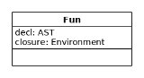
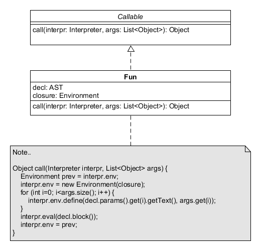
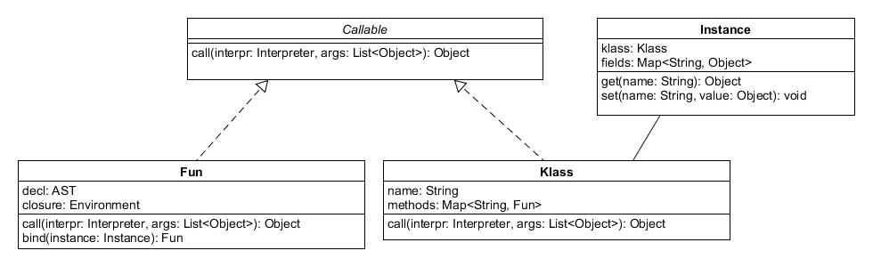

## Funktionen

:::::: columns
::: {.column width="50%"}

\vspace{20mm}

```java
int foo(int a, int b, int c) {
    print a + b + c;
}

foo(1, 2, 3);
```

:::
::: {.column width="40%"}

\pause

```java
fun makeCounter() {
    var i = 0;
    fun count() {
        i = i + 1;
        print i;
    }

    return count;
}

var counter = makeCounter();
counter(); // "1".
counter(); // "2".
```

:::
::::::

::: notes
[Quelle: nach [@Nystrom2021], Kapitel "Functions" ([MIT](https://github.com/munificent/craftinginterpreters/blob/master/LICENSE))]{.origin}


Die Funktionsdeklaration muss im aktuellen Kontext abgelegt werden,
dazu wird der AST-Teilbaum der Deklaration benötigt.

Beim Aufruf muss man das Funktionssymbol im aktuellen Kontext
suchen, die Argumente auswerten, einen neuen lokalen Kontext
anlegen und darin die Parameter definieren (mit den eben ausgewerteten
Werten) und anschließend den AST-Teilbaum des Funktionskörpers im
Interpreter mit `eval` auswerten ...
:::


## Ausführen einer Funktionsdeklaration

```yacc
funcDecl : type ID '(' params? ')' block ;
funcCall : ID '(' exprList? ')' ;
```

\bigskip

:::::: columns
::: {.column width="55%"}

```java
Void funcDecl(AST t) {
    Fun fn = new Fun(t, env);
    env.define(t.ID().getText(), fn);
    return null;
}
```

:::
::: {.column width="35%"}

:::
::::::

::: notes
[Quelle: nach [@Nystrom2021], Kapitel "Functions", [`Function.java`](https://github.com/munificent/craftinginterpreters/blob/master/java/com/craftinginterpreters/lox/LoxFunction.java#L6)  ([MIT](https://github.com/munificent/craftinginterpreters/blob/master/LICENSE))]{.origin}

Man definiert im aktuellen Environment den Funktionsnamen und hält dazu
den aktuellen Kontext (aktuelles Environment) sowie den AST-Knoten mit
der eigentlichen Funktionsdefinition fest.

Für *Closures* ist der aktuelle Kontext wichtig, sobald man die
Funktion ausführen muss. In [@Parr2010, S.236] wird beispielsweise
einfach nur ein neuer Memory-Space (entspricht ungefähr hier einem
neuen lokalen Environment) angelegt, in dem die im Funktionskörper
definierten Symbole angelegt werden. Die Suche nach Symbolen erfolgt
dort nur im Memory-Space (Environment) der Funktion bzw. im globalen
Scope (Environment).
:::


## Ausführen eines Funktionsaufrufs

```java
Object funcCall(AST t) {
    Fun fn = (Fun)eval(t.ID());

    List<Object> args = new ArrayList<>();
    for (AST a : t.exprList()) {
        args.add(eval(a));
    }

    Environment prev = env;  env = new Environment(fn.closure);
    for (int i=0; i<args.size(); i++) {
        env.define(fn.decl.params().get(i).getText(), args.get(i));
    }

    eval(fn.decl.block());

    env = prev;
    return null;
}
```

::: notes

[Quelle: nach [@Nystrom2021], [`Function.java`](https://github.com/munificent/craftinginterpreters/blob/master/java/com/craftinginterpreters/lox/LoxFunction.java#L57) ([MIT](https://github.com/munificent/craftinginterpreters/blob/master/LICENSE))]{.origin}

Zunächst wird die `ID` im aktuellen Kontext ausgewertet. In der obigen Grammatik
ist dies tatsächlich nur ein Funktionsname, aber man könnte über diesen Mechanismus
auch Ausdrücke erlauben und damit Funktionspointer bzw. Funktionsreferenzen
realisieren ... Im Ergebnis hat man das Funktionsobjekt mit dem zugehörigen AST-Knoten
und dem Kontext zur Deklarationszeit.

Die Argumente der Funktion werden nacheinander ebenfalls im aktuellen Kontext
ausgewertet.

Um den Funktionsblock auszuwerten, legt man einen neuen temporären Kontext über
dem Closure-Kontext der Funktion an und definiert darin die Parameter der Funktion
samt den aktuellen Werten. Dann lässt man den Interpreter über den Visitor-Dispatch
den Funktionskörper evaluieren und schaltet wieder auf den Kontext vor der
Funktionsauswertung zurück.
:::


## Funktionsaufruf: Rückgabewerte

:::::: columns
::: {.column width="45%"}

\vspace{35.5mm}

```java
Object funcCall(AST t) {
    ...

    eval(fn.decl.block());

    ...
    return null;
}
```

:::
::: {.column width="55%"}

\pause

```java
class Return extends RuntimeException {
    Object value;
    Return(Object v) { value = v; }
}

Void return(AST t) {
    throw new Return(eval(t.expr()));
}
Object funcCall(AST t) {
    ...
    Object erg = null;
    try { eval(fn.decl.block()); }
    catch (Return r) { erg = r.value; }
    ...
    return erg;
}
```

:::
::::::

::: notes

[Quelle: nach [@Nystrom2021], [`Return.java`](https://github.com/munificent/craftinginterpreters/blob/master/java/com/craftinginterpreters/lox/Return.java#L4), [`Function.java`](https://github.com/munificent/craftinginterpreters/blob/master/java/com/craftinginterpreters/lox/LoxFunction.java#L74) ([MIT](https://github.com/munificent/craftinginterpreters/blob/master/LICENSE))]{.origin}

Rückgabewerte für den Funktionsaufruf werden innerhalb von `block` berechnet,
wo eine Reihe von Anweisungen interpretiert werden, weshalb `block` ursprünglich
keinen Rückgabewert hat. Im Prinzip könnte man `block` etwas zurück geben lassen,
was durch die möglicherweise tiefe Rekursion relativ umständlich werden kann.

An dieser Stelle kann man den Exceptions-Mechanismus **missbrauchen** und bei
der Auswertung eines `return` mit dem Ergebniswert direkt zum Funktionsaufruf
zurück springen. In Methoden, wo man einen neuen lokalen Kontext anlegt und
die globale `env`-Variable temporär damit ersetzt, muss man dann ebenfalls
mit `try/catch` arbeiten und im `finally`-Block die Umgebung zurücksetzen und
die Exception erneut werfen.
:::


## Native Funktionen

```java
interface Callable { Object call(Interpreter i, List<Object> a); }
Interpreter() {
    globals.define("print", new Callable() {
        public Object call(Interpreter i, List<Object> a) {
            for (Object o : a) { System.out.println(a); }
            return null;
        }
    });
}
class Fun implements Callable { ... }
Object funcCall(AST t) {
    ...
//  Environment prev = env;  env = new Environment(fn.closure);
//  for (int i=0; i<args.size(); i++) { ... }
//  eval(fn.decl.block());  env = prev;
    fn.call(this, args);
    ...
}
```

::: notes

[Quelle: nach [@Nystrom2021], [`Callable.java`](https://github.com/munificent/craftinginterpreters/blob/master/java/com/craftinginterpreters/lox/LoxCallable.java#L6), [`Function.java`](https://github.com/munificent/craftinginterpreters/blob/master/java/com/craftinginterpreters/lox/LoxFunction.java#L6) ([MIT](https://github.com/munificent/craftinginterpreters/blob/master/LICENSE))]{.origin}




Normalerweise wird beim Interpretieren eines Funktionsaufrufs der
Funktionskörper (repräsentiert durch den entsprechenden AST-Teilbaum)
durch einen rekursiven Aufruf von `eval` ausgewertet.

Für native Funktionen, die im Interpreter eingebettet sind, klappt
das nicht mehr, da hier kein AST vorliegt.

Man erstellt ein neues Interface `Callable` mit der Hauptmethode `call`
und leitet die frühere Klasse `Fun` davon ab: `class Fun implements Callable`.
Die Methode `funcCall` ruft nun statt der `eval`-Methode die `call`-Methode
des Funktionsobjekts auf und übergibt den Interpreter (== Zustand) und
die Argumente. Die `call`-Methode der Klasse `Fun` muss nun ihrerseits
im Normalfall den im Funktionsobjekt referenzierten AST-Teilbaum des
Funktionskörpers mit dem Aufruf von `eval` interpretieren ...

Für die nativen Funktionen leitet man einfach eine anonyme Klasse
ab und speichert sie unter dem gewünschten Namen im globalen Kontext
des Interpreters. Die `call`-Methode wird dann entsprechend der
gewünschten Funktion implementiert, d.h. hier erfolgt kein weiteres
Auswerten des AST.
:::


## Klassen und Instanzen I

```yacc
classDef : "class" ID "{" funcDecl* "}" ;
```

\bigskip

```java
public Void classDef(AST t) {
    Map<String, Fun> methods = new HashMap<>();
    for (AST m : t.funcDecl()) {
        Fun fn = new Fun(m, env);
        methods.put(m.ID().getText(), fn);
    }

    Clazz clazz = new Clazz(t.ID().getText(), methods);
    env.define(t.ID().getText(), clazz);

    return null;
}
```

::: notes
[Quelle: nach [@Nystrom2021], [`Parser.java`](https://github.com/munificent/craftinginterpreters/blob/master/java/com/craftinginterpreters/lox/Parser.java#L78), ([MIT](https://github.com/munificent/craftinginterpreters/blob/master/LICENSE))]{.origin}

**Anmerkung**: Diese Darstellung ist angelehnt an [@Nystrom2021, Kapitel "Classes"].
Bei dieser Formulierung wird davon ausgegangen, dass Attribute zur Laufzeit durch
Zugriff auf das Attribut in der Klasse (bzw. der Instanz) angelegt werden.
:::


## Klassen und Instanzen II

:::notes
```java
class Clazz implements Callable {
    String name;
    Map<String, Fun> methods;

    Clazz(String name, Fun> methods) {
        this.name = name;
        this.methods = methods;
    }

    Object call(Interpreter i, List<Object> a) {
        Instance inst = new Instance(this);  return inst;
    }

    Fun findMethod(String name) {
        if (methods.containsKey(name)) {
            return methods.get(name);
        }
        return null;
    }
}
class Instance {
    Clazz clazz;
    Map<String, Object> fields = new HashMap<>();

    Instance(Clazz clazz) {
        this.clazz = clazz;
    }

    Object get(String name) {
        if (fields.containsKey(name)) {
            return fields.get(name);
        }

        Fun method = clazz.findMethod(name);
        if (method != null) return method.bind(this);

        throw new RuntimeError(name, "Undefined property");
    }
     void set(String name, Object value) {
        fields.put(name, value);
    }
}
```

[Quelle: nach [@Nystrom2021], [`Class.java`](https://github.com/munificent/craftinginterpreters/blob/master/java/com/craftinginterpreters/lox/LoxClass.java#L11), [`Instance.java`](https://github.com/munificent/craftinginterpreters/blob/master/java/com/craftinginterpreters/lox/LoxInstance.java#L7) ([MIT](https://github.com/munificent/craftinginterpreters/blob/master/LICENSE))]{.origin}



Instanzen einer Klasse werden durch den funktionsartigen Aufruf der Klassen
angelegt (parameterloser Konstruktor). Eine Instanz hält die Attribute
und eine Referenz auf die Klasse, um später an die Methoden heranzukommen.
:::


## Attribute

```yacc
getExpr : obj "." ID ;
setExpr : obj "." ID = expr ;
```

\bigskip

```java
Object getExpr(AST t) {
    Object obj = eval(t.obj());

    if (obj instanceof Instance) {
        return ((Instance)obj).get(t.ID().getText());
    }

    throw new RuntimeError(t.obj().getText(), "no object");
}
```

::: notes
```java
Object setExpr(AST t) {
    Object obj = eval(t.obj());

    if (!(obj instanceof Instance)) {
        throw new RuntimeError(t.obj().getText(), "no object");
    }

    Object value = eval(t.expr());
    ((Instance)obj).set(t.ID().getText(), value);

    return value;
}
```
[Quelle: nach [@Nystrom2021], Kapitel "Classes"]{.origin}

:::

::: notes

Beim Zugriff auf Attribute muss das Objekt im aktuellen Kontext evaluiert
werden. Falls es eine Instanz von `Instance` ist, wird auf das Feld per
interner Hash-Map zugriffen; sonst Exception.
:::


## Methoden und *this*

```java
class Fun implements Callable {
    Fun bind(Instance i) {
        Environment e = new Environment(closure);
        e.define("this", i);
        return new Fun(decl, e);
    }
}
```

[[Hinweis: Python "`self`"]{.bsp}]{.slides}

[Quelle: nach [@Nystrom2021], [`Function.java`](https://github.com/munificent/craftinginterpreters/blob/master/java/com/craftinginterpreters/lox/LoxFunction.java#L31), ([MIT](https://github.com/munificent/craftinginterpreters/blob/master/LICENSE))]{.origin}

::: notes

Nach dem Interpretieren von Klassendefinitionen sind die Methoden in der Klasse
selbst gespeichert, wobei der jeweilige `closure` auf den Klassenkontext zeigt.

Beim Auflösen eines Methodenaufrufs wird die gefundene Methode an die
Instanz gebunden, d.h. es wird eine neue Funktion angelegt, deren `closure`
auf den Kontext der Instanz zeigt. Zusätzlich wird in diesem Kontext noch die
Variable "`this`" definiert, damit man damit auf die Instanz zugreifen kann.

In Python wird das in der Methodensignatur sichtbar: Der erste Parameter ist
eine Referenz auf die Instanz, auf der diese Methode ausgeführt werden soll ...
:::


<!-- TODO
## Vererbung (Skizze)

TODO
-->


## Wrap-Up

*   Interpreter simulieren die Programmausführung
    *   Namen und Symbole auflösen
    *   Speicherbereiche simulieren
    *   Code ausführen: Read-Eval-Loop

\smallskip

*   Traversierung des AST: `eval(AST t)` als Visitor-Dispatcher
*   Scopes mit `Environment` (analog zu Symboltabellen)
*   Interpretation von Funktionen (Deklaration/Aufruf, native Funktionen)
*   Interpretation von Klassen und Instanzen


<!-- DO NOT REMOVE - THIS IS A LAST SLIDE TO INDICATE THE LICENSE AND POSSIBLE EXCEPTIONS (IMAGES, ...). -->
::: slides
## LICENSE


Unless otherwise noted, this work is licensed under CC BY-SA 4.0.

### Exceptions
*   TODO (what, where, license)
:::
