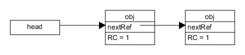
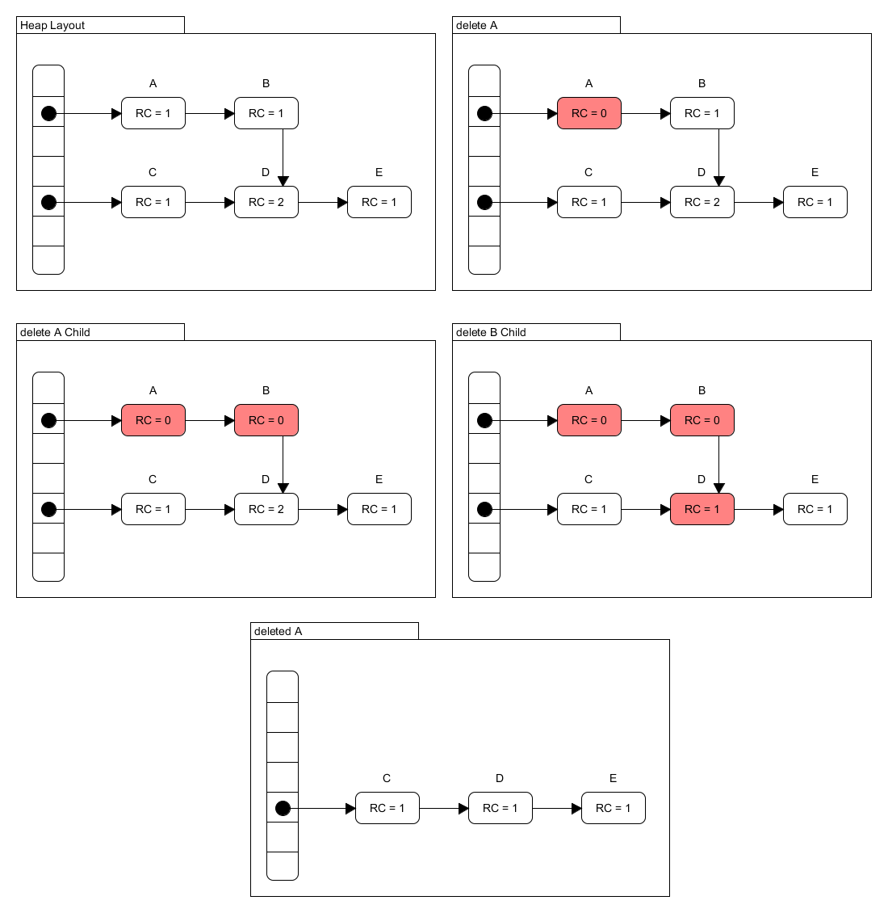
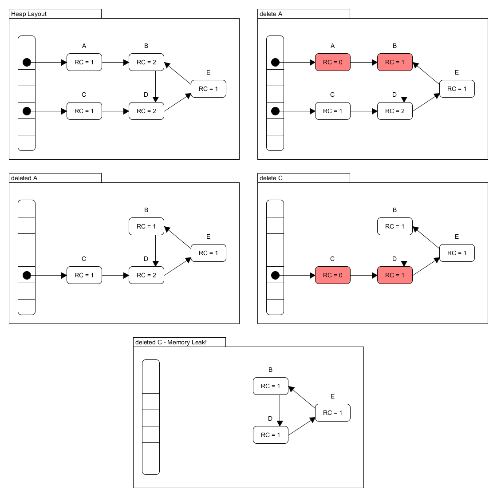

## Ist das Code oder kann das weg?

:::::: columns
::: {.column width="45%"}
```python
x = 42
y = 'wuppie'
y = 'fluppie'
print(y)
```
:::
::: {.column width="45%"}
```python
def foo():
    x = 'wuppie'
    def bar():
        print(x)
    return f

fn = foo()
fn()
```
:::
::::::

::: notes
Bei der Erzeugung von Bytecode für eine VM kann man die Konstanten direkt einem
Konstanten-Array sammeln und im Bytecode mit den entsprechenden Indizes arbeiten.
Das entspricht dem Vorgehen bei der Maschinencode-Erzeugung, dort sammelt man die
Konstanten typischerweise am Ende des Text-Segments.

Bei der Abarbeitung des Bytecodes durch die VM legt diese Objekte für globale und
lokale Variablen, Strings sowie für Funktionen etc. an. Der Speicher dafür wird
dynamisch auf dem Heap reserviert, und die Adressen beispielsweise im Stack (bei
lokalen Variablen) oder in Hashtabellen (Funktionsnamen, globale Variablen) o.ä.
gespeichert.

Wenn Objekte nicht mehr benötigt werden, sollten sie also freigegeben werden, da
sonst der Heap der VM voll läuft. Im obigen Beispiel wird der Speicher für `wuppie`
unerreichbar, sobald man die Zuweisung `y = 'fluppie'` ausführt. Andererseits
darf man aber auch nicht zu großzügig Objekt aufräumen: Die lokale Variable `x`
in `foo` wird in der beim Aufruf erzeugten Funktion `bar` benötigt (*Closure*) und
muss deshalb von der Lebensdauer wie eine globale Variable behandelt werden.
:::


## Erreichbarkeit


[Quelle: [@Nystrom2021], [`reachable.png`](https://github.com/munificent/craftinginterpreters/blob/master/site/image/garbage-collection/reachable.png), ([MIT](https://github.com/munificent/craftinginterpreters/blob/master/LICENSE))]{.origin}

::: notes
1. Erreichbar sind zunächst alle "Wurzeln", d.h. alle Objekte, die direkt über den
Stack oder die Konstanten-Arrays oder die Hashtabelle mit den globalen Variablen
(und Funktionen) erreichbar sind.

2. Alle Objekte, die von erreichbaren Objekten aus erreichbar sind, sind ebenfalls
erreichbar.

"Objekt" meint dabei im Zuge der Bytecode-Generierung oder während der Bearbeitung
durch die VM erstellte Werte/Objekte, die auf dem Heap alloziert wurden und durch
die VM aktiv freigegeben werden müssen.
:::


## "Präzises GC": Mark-Sweep Garbage Collection

::: notes
Das führt zu einem zweistufigen Algorithmus:

1.  **Mark**: Starte mit den Wurzeln und traversiere so lange durch die Objektreferenzen,
    bis alle erreichbaren Objekte besucht wurden.
2.  **Sweep**: Lösche alle anderen Objekte.
:::


[Quelle: [@Nystrom2021], [`mark-sweep.png`](https://github.com/munificent/craftinginterpreters/blob/master/site/image/garbage-collection/mark-sweep.png), ([MIT](https://github.com/munificent/craftinginterpreters/blob/master/LICENSE))]{.origin}

::: notes
Die Strukturen für Objekte und die VM werden ergänzt: Objekte erhalten noch
ein Flag für die Markierung.

Zum Auffinden der erreichbaren Objekte wird mit einem Färbungsalgorithmus
gearbeitet. Initial sind alle Objekte "weiß" (nicht markiert).

### Phase "Mark": Wurzeln markieren

Im ersten Schritt färbt man alle "Wurzeln" "grau" ein. Dabei werden alle
Objektreferenzen im Stack der VM, in der Hashtabelle für globale Variablen
der VM, in der Konstantentabelle des Bytecode-Chunks sowie in den Funktionspointern
betrachtet: Über diese Datenstrukturen wird iteriert und alle auf dem Heap
der Laufzeitumgebung allozierten Strukturen/Objekte werden markiert, indem
ihr Flag gesetzt wird. Zusätzlich werden die Pointer auf diese Objekte in
einen `grayStack` hinzugefügt. Damit sind alle Wurzeln "grau" markiert".

### Phase "Mark": Trace

Nachdem alle Wurzeln "grau" markiert wurden und auf den `grayStack` der VM
gelegt wurden, müssen nun mögliche Verweise in den Wurzeln verfolgt werden.
Dazu entfernt man schrittweise die Objekte vom Stack und betrachtet sie damit
als "schwarz". (Das Markierungs-Flag bleibt gesetzt, "schwarz" sind die Objekte,
weil sie nicht mehr auf dem `grayStack` der VM liegen.) Sofern das aktuell
betrachtete Objekt seinerseits wieder Referenzen hat (beispielsweise haben
Funktionen wieder einen Bytecode-Chunk mit einem Konstanten-Array), werden
diese Referenz iteriert und alle dabei aufgefundenen Objekte auf den `grayStack`
der VM gelegt und ihr Flag gesetzt.

Dieser Prozess wird so lange durchgeführt, bis der `grayStack` leer ist. Dann
sind alle erreichbaren Objekte markiert.

### Phase "Sweep"

Jetzt sind alle Objekte markiert: Das Flag ist jeweils entweder gesetzt oder
nicht gesetzt. Objekte, deren Flag nicht gesetzt ist, sind nicht mehr erreichbar
und können freigegeben werden.

Wenn die Objekte nicht erreichbar sind, wie kommt man dann an diese heran?

Die Strukturen für Objekte und die VM werden ergänzt. Objekte erhalten noch
einen `next`-Pointer, mit dem *alle* Objekte in einer verketteten Liste gehalten
werden können.

Wann immer für ein Objekt Speicher auf dem Laufzeit-Heap angefordert wird,
wird dieses Objekt in eine verkettete Liste aller Objekte der VM eingehängt.
Über diese Liste wird nun iteriert und alle "weißen" (nicht markierten) Objekte
werden ausgehängt und freigegeben.

Zusätzlich müssen alle verbleibenden Objekte für den nächsten GC-Lauf wieder
entfärbt werden, d.h. die Markierung muss wieder zurückgesetzt werden.

### Hinweise

Die Mark-and-Sweep-GC-Variante wird auch "präzise Garbage Collection" genannt,
da dabei alle nicht mehr benötigten Objekte entfernt werden.

Da während der Durchführung der GC die Abarbeitung des Programms pausiert wird,
hat sich deshalb auch die Bezeichnung *stop-the-world GC* eingebürgert.
:::


## Metriken: Latenz und Durchsatz

::: notes
*   **Latenz**: Längste Zeitdauer, während der das eigentliche Programm (des Users)
    pausiert, beispielsweise weil gerade eine Garbage Collection läuft

*   **Durchsatz**: Verhältnis aus Zeit für den User-Code zu Zeit für Garbage Collection

    Beispiel: Ein Durchsatz von 90% bedeutet, dass 90% der Rechenzeit für den User
    zur Verfügung steht und 10% für GC verwendet werden.
:::

::: center


[Quelle: [@Nystrom2021], [`latency-throughput.png`](https://github.com/munificent/craftinginterpreters/blob/master/site/image/garbage-collection/latency-throughput.png), [MIT](https://github.com/munificent/craftinginterpreters/blob/master/LICENSE)]{.origin}
:::


## Self-adjusting Heap

*   GC selten: Hohe Latenz (lange Pausen)
*   GC oft: Geringer Durchsatz

\bigskip

**Heuristik**

*   Beobachte den allozierten Speicher der VM
*   Wenn [vorher festgelegte (willkürliche)]{.notes} Grenze überschritten: GC
*   Größe des verbliebenen Speichers mal Faktor \blueArrow neue Grenze

::: notes
Die Objekte bzw. der Speicherverbrauch, der nach einem GC-Lauf übrig bleibt, ist
ein Indikator für den aktuell nötigen Speicher. Deshalb setzt man die neue Schwelle,
ab der der nächste GC-Lauf gestartet wird, ungefähr auf diesen Speicherverbrauch mal
einem gewissen Faktor (beispielsweise den Wert 2), um nicht sofort wieder einen
GC starten zu müssen ...
:::


## Generational GC

Die meisten Objekte haben oft eher eine kurze Lebensdauer. Wenn sie aber ein gewisses
"Alter" erreicht haben, werden sie oft noch weiterhin benötigt.

Man teilt den Heap in zwei unterschiedlich große Bereiche auf: Die "Kinderstube"
(*Nursery*) und den Heap für die "Erwachsenen". Neue Objekte kommen zunächst in die
Kinderstube, und dort wird regelmäßig GC ausgeführt. Bei jedem GC-Lauf wird der
Generationen-Zähler der "überlebenden" Objekte inkrementiert. Wenn die Objekte eine
bestimmte Anzahl an Generationen überlebt haben, werden sie in den Erwachsenenbereich
verschoben, wo deutlich seltener eine GC durchgeführt wird.
:::

[[Hinweis: Generational GC ]{.bsp}]{.slides}

::: notes
**Anmerkung**: Man unterscheidet zusätzlich noch zwischen *konservativem*
und *präzisem* GC:

*   *Konservatives* GC geht eher vorsichtig vor: Wenn ein Speicherbereich
    möglicherweise noch benötigt werden *könnte*, wird er nicht angefasst;
    alles, was auch nur so aussieht wie ein Pointer wird entsprechend behandelt.
*   *Präzises* GC "weiss" dagegen genau, welche Werte Pointer sind und welche
    nicht und handelt entsprechend.
:::

## Konservative Garbage Collection

* Von Boehm und Weiser

* Sammelt automatisch die Collection

* Kann Pointer im Speicher finden ohne die innere Struktur eines Objektes zu kennen
  * Interpretiert alle Daten in dem Speicherbereich, in dem Pointer gesucht werden, als Pointer
  * Die Daten werden unsichere Pointer genannt, da der Collector nicht weiß, ob sie Pointer sind.
  * Prozessorregister, den Stack und alle statischen Daten werden so untersucht, um den Root zu finden.


## Allocation

* 4 KB große Blöcke
  * Aufgeteilt in Objektbereich und Verwaltungsbereich.
  * Objektbereich
    * Objekt
  * Verwaltungsbereich
    * die Größe des gespeicherten Objektes
    * Anzahl an gespeicherten Objekten
    * Bit-Feld für die Mark-Phase
* Beim anfordern von Speicherplatz wird geschaut ob in der Blockliste und im Verwaltungsbereich des entsprechendem Blockes  ein freies Objekt mit der Größe gibt
  * Wenn ja, wird die Objektanzahl des Blockes inkrementiert und ein Pointer auf dieses Objekt zurückgegeben
  * Wenn nein, wird ein neuer Block initialisiert und ein Pointer auf das erste Objekt zurückgegeben


## Collection

* Inspiziert die Prozessorregister, den Stack und die statischen Objekte
* Alle Daten werden als Adressen interpretiert und müssen getestet werden, ob sie gültige Pointer sind
* Es sind keine gültigen Pointer,
  * Wenn die Adresse höher oder niedriger als die höchste oder niedrigste Adresse im Heap ist
  * Wenn die Adresse *nicht* innerhalb eines Blockes liegt also die Adresse nicht in der Blockliste vorkommt
  * Wenn die Adresse in die Mitte und nicht am Anfangen eines Objektes zeigt
  * Wenn die Adresse auf ein Objekt in der Free-List zeigt
* Die Objekte auf den ein gültiger Pointer zeigt kann dadurch als erreichbar markiert werden
* Diese Objekte werden als Root-Objekte inspiziert, also alle Daten werden als Pointer interpretiert, getestet und ggf. die Objekte auf die Pointer zeigen, markiert
* Die Collection endet, wenn die Objekte inpiziert wurden und alle nicht markierten Objekte in die Free-Liste aufgenommen wurden


## Blacklisting

* Soll Fehlinterpretationen von unsicherer Pointer verringern
* Mark-Phase
  * In die Black-List wird jeder unsichere Pointer eingetragen, der sich nach den Test als ungültig erweist
* Allocation
  * Es kann kein Objekt an eine Adresse alloziert werden, wenn die Adresse in der Black-List steht

Das ganze wird umgesetzt, indem eine Seite des Heaps nicht verwendet wird, wenn ein Pointer in der Black-List in diese Seite zeigt. Durch die virtuelle Speicherverwaltung wird der Speicher erst zur Verfügung gestellt, wenn auf die Seite zugegriffen wird. Dadurch wird auch kein Speicher verschenkt. Der Aufwand für das Blacklisting liegt bei unter 1% der für Allocation und Collection verbrauchten Laufzeit.


## Vor- und Nachteile der Konservative Garbage Collection

Vorteile:

* Keine explizite Kooperation für die Speicherverwaltung nötig
* Die Speicherverwaltung muss nur eine Bedingung erfüllen
  * Jedes benutze Objekt hat ein Pointer auf den Anfang (innerhalb des Zugriffsbereichs des Collectors)
* Kann mit anderen Speicherverwaltungen koexistieren
* Explizite Deallocation ist möglich
* Kann jederzeit abgebrochen werden
  * Praktisch in Verbindung mit opportunistischer Garbage Collection in interaktiven Applikationen


Nachteile:

* Mark-Phase dauert durch die zusätzlichen Tests länger
* Die Möglichkeit einer Fragmentierung des Speichers ist hoch.
  * In manchen Situationen kann etwa die hälfte des Heaps nicht genutzt werden, da die freien Objekte nicht die vom der Speicherverwaltung benötigte Größe hatten
* Fehlinterpretationen können dafür sorgen, dass unsichere Pointer nicht freigegeben werden
* Bei hoch optimierten Compilern ist der Collector nicht zuverlässig, da die Adressen nicht mehr auf die benutzen Objekte zeigt


## Reference Counting

* Eine Technik zum Speichern von Pointern
* Kein Tracing Garbage Collector mehr

* Die Objekte werden freigegeben sobald sie nicht mehr referenziert werden

* Jedes Objekt bekommt einen Referenz-Counter
  * Zählt die Anzahl der Pointerreferenzen auf jedes zugewiesene Objekt
  * Wenn der Counter auf 0 gesetzt wird es gelöscht
* Eine einfache Form der Speicherverwaltung
* Ohne Collection zyklen zum sammeln der Objekte
* Probleme mit zyklischen Datenstrukturen


## Algorithmus

* Erstellen eines Objektes
  * Speicher zuweisen
  * Referenz Counter auf 1 setzen

```python
def new():
    obj = alloc_memory()
    obj.set_ref_counter(1)
    return obj
```

*new()* wird beim erstellen eines Objektes aufgerufen.




* Löschen eines Objektes
  * Referenz-Counter um 1 runter zählen
  * Wenn der Counter auf 0 ist
    * Wird für jedes Unterobjekt delete aufgerufen
    * Der Speicherplaz für das Objekt wird freigegeben

```python
def delete(obj):
    obj.dec_ref_counter()
    if obj.get_ref_counter() == 0:
        for child in children(obj):
			delete(child)
		freeObject(obj)
```

*delete()* wird aufgerufen, wenn das Objekt nicht weiter vom Programm verwendet wird. Hierbei wird gecheckt, ob auf das Objekt referenziert wird.

::: center



:::

* Updaten eines Objektes
  * *target* Referenz-Counter um 1 hoch zählen
  * Für *source* wird delete aufgerufen
  * *source* wird mit *target* überschrieben

```python
def update(source, target):
	# increment before deleting, source == target case.
	target.inc_ref_count()
	delete(source)
	source = target
```

Update wird aufgerufen, wenn ein Objekt einem neuen Speicherplatz(*target*) zugewiesen wird, der "alte" Speicherplatz(*soruce*) wird freigegeben.


## Probleme

Das größte Problem beim Referenz Counting ist, der Umgang mit zyklischen Datenstrukturen, wie z.B verkettete Listen oder einfache Graphen. Durch den Algorithmus zum Löschen und freigeben der Objekte kann es dazu kommen, dass sich zyklische Datenstrukturen nicht gelöscht und freigegeben werden können und ein Speicherverlust entsteht.

Das folgende Beispiel erläutert dieses Problem:

::: center



:::

## Stop-and-Copy Garbage Collection

* teile Heap in zwei Bereiche (A und B)
* alloziere nur Speicher aus A bis der Bereich voll ist
* stoppe Programmausführung und kopiere alle erreichbaren Objekte von A nach B
* gesamten Speicher aus Bereich A freigeben
* setze Programmausführung mit vertauschten Rollen von A und B fort


## Vor- und Nachteile von Stop-and-Copy GC

Vorteile:

* nur ein Lauf über Daten nötig
* automatische Speicherdefragmentierung
* Aufwand proportional zur Menge der erreichbaren Objekte und nicht zur Größe des Speichers
* zyklische Referenzen sind kein Problem


Nachteile:

* benötigt doppelten Speicherplatz für gegebene Heapgröße
* Objekte werden im Speicher bewegt (Update von Referenzen nötig)
* Programm muss für GC angehalten werden


## Weitere Alternativen

* Inkrementelles GC

* Concurrent GC

*   Generational GC: Markieren der "Generationen" der Lebensdauer, Umsortieren
    "erwachsener" Objekte in Speicherbereich mit weniger häufigem GC


## Benchmarking
[Hauptseite](https://ionutbalosin.com/2019/12/jvm-garbage-collectors-benchmarks-report-19-12/)

[Ergebnisse](http://htmlpreview.github.io/?https://github.com/ionutbalosin/jvm-performance-benchmarks-reports/blob/master/19_12_report_openjdk-13/jmh_visualizer_gc/index.html)


* Fokusieren die Metriken:
  * Effizenz der Rückgewinnung von Objekten
    *	Unterschiedliche Allokationsraten für kleine und gr0ße Objekte
    *	mit und ohne konstante Speicherbelegung im Heap
  * Auswirkung auf Lese-/Schreibebarrieren oder das Aktualisieren der Heap-Datenstruktur während der Laufzeit
    *	jede explizite Zuweisung wird vermieden, wenn sie nicht durch das Ökosystem vorgegen wird
  * *Fußabdruck* der internen GC-Strukturen


* Um die folgenden Benchmarks an einem Beispiel zu zeigen. Werden die folgenden GCs verwendet: Serial GC, Parallel/ParallelOld GC, Concurrent Mark Sweep (CMS) GC, Garbage First (G1) GC, Shenandoah GC, ZGC und Epsilon GC. Alle Garbage Collectoren sind aus AdoptOpenJDK 64-Bit Server VM version 13


::: notes

Read-/Writebarrier [ReadWrite](https://stackoverflow.com/questions/1787450/how-do-i-understand-read-memory-barriers-and-volatile)

:::

## Setup

* Alle Benchmarks werden in der selben Programmiersprache entwickelt z.B ( Java mit JMH v1.22)
* Jeder Benchmark verwendet:
  * 5x10s warm up Iteration
  * 5X10s measurement iteration
  * 3 JVM forks
  * Single Thread
    * Sorgt allerdings dafür, dass concurrent GC besser als Stop-the-World GCś laufen, da diese die Arbeit auf die ungenutzen Kerne auslagert
* Die gleiche Hardware und Software Vorraussetzungen
* Für Benchmarks die auf die hohe Objektzuweisungensrate abzielen
  * Wird die anfängliche Heap-Größe auf das maximum gesetzt
  * Verwendet PreTouch um Größenanpassung und Speicherübergabe zu vermeiden
  * z.B *-Xms4g -Xmx4g -XX:+AlwaysPreTouch*
* Auswirkungen der dynamischen Frequenzskalierung zu eliminieren
  * intel_pstate-Treiber deaktivieren
  * CPU-Governor auf performance stellen
* Hinweis: Die Benchmarks können von anderen Faktoren beeinflusst werden
  * Just-In-Time Compiler Optimierungen, Bibiliotheken, CPU-Caching usw.


## Benchmark: BurstHeapMemoryAllocatorBenchmark

Dieser Benchmark erstellt eine Menge an temporärer Objekten. Dabei werden die Objekte mit einer ArrayList stark Referenziert. Wenn ein bestimmter Prozentsatz des heaps belegt ist, werden die Objekte mit *blackhole.consume(junk);* frei gegeben. Damit wird die Menge an Objekte nahezu gleichzeitig für den Garbage Collector freigegeben.

```java
void allocate(int sizeInBytes, int numberOfObjects) {
    for (int iter = 0; iter < 4; iter++) {
        List<byte[]> junk = new ArrayList<>(numberOfObjects);
        for (int j = 0; j < numberOfObjects; j++) {
            junk.add(new byte[sizeInBytes]);
        }
        blackhole.consume(junk);
    }
}
```

* sizeInBytes
  * _4_KB, _4_MB
* numberofObjects
  * WIrd automatisch berechnet so, dass 60 % des verfügbaren Heapspeicherplatz verbrauchen werden


Ergebnis zum Benchmark mit den bereits genannten Garbage Collectoren

* ZGC und Shenandoah GC haben deutlich bessere Ergebnisse als die anderen Collectoren.
* G1 GC bietet zwar einen schlechteren Durchsatz als ZGC und Shenandoah GC, allerdings mit dem großen Objekten(_4_MB) erziehlte es besser Ergebnisse als CMS GC, ParallelOld GC und Serial GC.


## Benchmark: ConstantHeapMemoryOccupancyBenchmark

Für diesen Benchmark wird während des Setups eine Menge von Objekten mit starken Verweisen vorab zugeweisen. Diese Menge sollte den Heap bis ca. 70% belegen. Die Objekte können dabei eine große Kette aus zusammengesetzten Klassen sein. Dies kann sich auf die Traversierung der GC-Roots auswirken (z. B. während der "parallelen" Markierungsphase), da der Grad der Zeigerumlenkung (d. h. der Referenzverarbeitung) während der Traversierung des Objektgraphen nicht zu vernachlässigen ist.

In der Benchmark selbst werden temporäre Objekte mit einer Größe von 8MB zugewiesen und direkt freigegeben. Da diese Objekt so groß ist folgt sie die *slow path allocation*. Außerdem kommt das Objekt in die Tenured Generation (im Falle von Generational Collectors)

```java
void test(Blackhole blackhole) {
    blackhole.consume(new byte[_8_MB]);
}
```

Ergebnis zum Benchmark mit den bereits genannten Garbage Collectoren

* CMS GC gefolgt von G1 GC erziehlen hier die besten Ergebnisse
* ZGC and Shenandoah GC erziehlten die schlechtesten Ergebnisse
  * Kosten für die Markierung des gesamten Heaps bei jedem Zyklus


## Benchmark: HeapMemoryBandwidthAllocatorBenchmark

Dieser Benchmark testet die Zuweisungrate für verschiedene Zuweisungsgrößen. Im Vergleich zum vorherigen Benchmark (ConstantHeapMemoryOccupancyBenchmark) werden hier nur temporäre Objekte zugewiesen und sofort wieder freigegeben, ohne dass vorher zugewiesene Objekte aufbewahrt werden.

```java
byte[] allocate() {
    return new byte[sizeInBytes];
}
```

sizeInBytes
* _4_KB, _4_MB

Ergebnis zum Benchmark mit den bereits genannten Garbage Collectoren
* Für große Objekte(_4_MB)
  * G1 GC bietet den schlechtesten Responsetime
  * ParallelOld GC ist am effizientesten
* Für kleine Objekte(_4_KB)
  * Ungefähr alle gleich, allerdings ist der Shenandoah GC ein wenig effizienter

## Benchmark: ReadWriteBarriersBenchmark

In diesem Benchmark wird der Overhead von den Lese-/Schreibebarrieren getestet, während sie durch ein Array von Integers iterieren und die Werte zwischen zwei Arrays austauschen. Das Array wird während des Setups initialisiert, so dass beim Benchmark fast keine Zuweisungen entstehen.

```java
void test() {
    int lSize = size;
    int mask = lSize - 1;

    for (int i = 0; i < lSize; i++) {
        Integer aux = array[i];
        array[i] = array[(i + index) & mask];
        array[(i + index) & mask] = aux;
    }

    index++;
}
```

Ergebnis zum Benchmark mit den bereits genannten Garbage Collectoren
* Epsilon GC hat die besten Ergebnisse, da der Collector keine Barrieren verwendet
* Shenandoah GC hat nach Epsilon GC die besten Ergbnisse
* G1 GC bietet die schlechtesten Ergebnisse mit 10x-14x langsamer als der Rest der Collectoren (wahrscheinlich wegen den PostWrite Barrier)


## Benchmark: WriteBarriersLoopingOverArrayBenchmark

In diesem Benchmark wird der Overhead von Schreibbarrieren getestet, während sie durch die Elemente eines Arrays von Integers iterieren und jedes Element davon aktualisieren. Hierbei werden keine Zuweisungen verwendet.

```java
void test(Integer lRefInteger) {
    int lSize = size;

    for (int i = 0; i < lSize; i++) {
        array[i] = lRefInteger;
    }
}
```

Ergebnis zum Benchmark mit den bereits genannten Garbage Collectoren
* Epsilon GC hat die besten Ergebnisse, da der Collector keine Barrieren verwendet
* ZGC hat nach Epsilon GC die besten Ergbnisse
  * Unterstütz keine Compressed OOPs
* Auch in diesem Benchmark bietet G1 GC die schlechtesten Ergebnisse mit 10x-20x langsamer als der Rest der Collectoren (wahrscheinlich wegen den PostWrite Barrier)

## Benchmark: ReadBarriersLoopingOverArrayBenchmark

Dieser Benchmark testet den Overhead von Lesebarrieren, während sie durch die Elemente eines Arrays von Integers iterieren und jedes Element davon lesen.

Hinweis: Das Durchlaufen einer Schleife über ein Array begünstigt die Algorithmen, die die Barriere aufheben können, ohne die Kosten für die Barriere selbst zu berücksichtigen.

```java
int test() {
    int lSize = size;

    int sum = 0;
    for (int i = 0; i < lSize; i++) {
        sum += array[i];
    }

    return sum;
}
```

Ergebnis zum Benchmark mit den bereits genannten Garbage Collectoren
* ZGC bietet den besten Durchsatz
  * fehlende Möglichkeit, die Überprüfung der Lesebarrieren anzuheben
  * die Abwesenheit von Compressed OOPs, die jetzt umgekehrt auftritt im Vergleich zum vorherigen Benchmark
* Alle anderen haben einen recht ähnlich Durchsatz
  * Hinweis: Serial GC, ParallelOld GC, CMS GC, G1 GC, Epsilon GC verwenden keine Lesebarriere


## Benchmark: ReadBarriersChainOfClassesBenchmark

Dieser Benchmark testet den Overhead von Lesebarrieren bei der Iteration durch große Ketten von vorab zugewiesenen Klasseninstanzen.

```java
int test() {
    return  h1.h2.h3.h4.h5.h6.h7.h8
           .h9.h10.h11.h12.h13.h14.h15.h16
           .h17.h18.h19.h20.h21.h22.h23.h24
           .h25.h26.h27.h28.h29.h30.h31.h32.aValue;
}

// where:
class H1 {
    H2 h2;

    H1(H2 h2) {
        this.h2 = h2;
    }
}

// ...

class H32 {
    int aValue;

    public H32(int aValue) {
        this.aValue = aValue;
    }
}
```

Ergebnis zum Benchmark mit den bereits genannten Garbage Collectoren
* Epsilon GC hat die besten Ergebnisse, da der Collector keine Barrieren verwendet
* Alle anderen Collectoren haben den gleichen Durchsatz


## Wrap-Up

*   Pflege verkette Liste alle Objekte in der VM

\smallskip

*   Mark-Sweep-GC:
    1.  Markiere alle Wurzeln ("grau", aus Stack und Hashtabelle)
    2.  Traversiere ausgehend von den Wurzeln alle Objekte und markiere sie
    3.  Gehe die verkettete Liste aller Objekte durch und entferne alle nicht markierten

\smallskip

*   Problem: Latenz und Durchsatz, Idee des "self-adjusting" Heaps


<!-- DO NOT REMOVE - THIS IS A LAST SLIDE TO INDICATE THE LICENSE AND POSSIBLE EXCEPTIONS (IMAGES, ...). -->
::: slides
## LICENSE


Unless otherwise noted, this work is licensed under CC BY-SA 4.0.

### Exceptions
*   TODO (what, where, license)
:::
