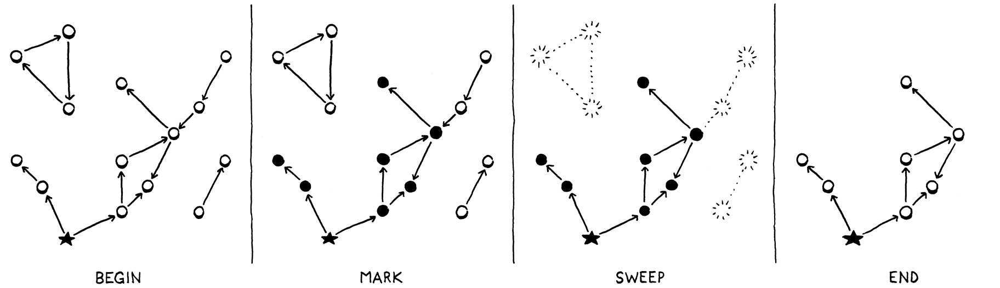

## Ist das Code oder kann das weg?

:::::: columns
::: {.column width="45%"}
```python
var a = "first value";
a = "updated";
print a;

a = 'first value'
a = 'updated'
print(a)
```
:::
::: {.column width="45%"}
```python
fun makeClosure() {
    var a = "data";

    fun f() { print a; }
    return f;
}

var closure = makeClosure();
closure();

def makeClosure():
    a = 'data'    
    def f():
        print(a)
    return f

closure = makeClosure()
# GC here
closure()
```
:::
::::::

[Quelle nach: [@Nystrom2021], Kapitel "Garbage Collection"]{.origin}


## Erreichbarkeit


[Quelle: [@Nystrom2021], [`reachable.png`](https://github.com/munificent/craftinginterpreters/blob/master/site/image/garbage-collection/reachable.png), ([MIT](https://github.com/munificent/craftinginterpreters/blob/master/LICENSE))]{.origin}

::: notes
Erreichbar sind zunächst alle "Wurzeln", d.h. alle Objekte, die direkt über den
Stack oder die Konstanten-Arrays oder die Hashtabelle mit den globalen Variablen
(und Funktionen) erreichbar sind.

Alle Objekte, die von erreichbaren Objekten aus erreichbar sind, sind ebenfalls
erreichbar.

"Objekt" meint dabei im Zuge der Bytecodegenerierung oder während der Bearbeitung
durch die VM erstellte Werte/Objekte, die auf dem Heap alloziert wurden und durch
die VM aktiv freigegeben werden müssen.
:::


## Mark-Sweep Garbage Collection

::: notes
Das führt zu einem zweistufigen Algorithmus:

1.  **Mark**: Starte mit den Wurzeln und traversiere so lange durch die Objektreferenzen,
    bis alle erreichbaren Objekte besucht wurden.
2.  **Sweep**: Lösche alle anderen Objekte.
:::



[Quelle: [@Nystrom2021], [`mark-sweep.png`](https://github.com/munificent/craftinginterpreters/blob/master/site/image/garbage-collection/mark-sweep.png), ([MIT](https://github.com/munificent/craftinginterpreters/blob/master/LICENSE))]{.origin}


## Phase "Mark": Wurzeln markieren

:::::: columns
::: {.column width="45%"}

```python
typedef struct sObj Obj;
struct sObj {
    ObjType type;
    bool isMarked;
    struct sObj* next;
};

class Obj():								
    def __init__(self, type, next):			# ObjType type, Obj next
        self.type = type
        self.next = next
        self.isMarked = false				# bool isMarked
```
[Quelle nach: [@Nystrom2018], [`object.h`](https://github.com/munificent/craftinginterpreters/blob/master/c/object.h#L91), Kapitel "Garbage Collection"]{.origin}

:::
::: {.column width="45%"}

```python
typedef struct {
    Chunk* chunk;
    ...
    Obj* objects;
    ...
    int grayCount;
    int grayCapacity;
    Obj** grayStack;
} VM;

class VM():
    def __init__(self):
        self.chunk = None
        self.objects = None
        self.grayCount = 0
        self.grayCapacity = 0
        self.grayStack = None
       
```
[Quelle nach: [@Nystrom2018], [`vm.h`](https://github.com/munificent/craftinginterpreters/blob/master/c/vm.h#L41), Kapitel "Garbage Collection"]{.origin}

:::
::::::

\bigskip
\bigskip

```c
object->isMarked = true;
vm.grayStack[vm.grayCount++] = object;

obj.isMarked = true
vm.grayStack[vm.grayCount++] = object; 
```

[Quelle nach: [@Nystrom2021], Kapitel "Garbage Collection"]{.origin}

::: notes
Die Strukturen für Objekte und die VM werden ergänzt. Objekte erhalten noch
ein Flag für die Markierung sowie einen `next`-Pointer, mit dem alle Objekte
in einer verketteten Liste gehalten werden können. Die VM erhält einen Stack
für die Verwaltung markierter Objekte.

Zum Auffinden der erreichbaren Objekte wird mit einem Färbungsalgorithmus
gearbeitet. Initial sind alle Objekte "weiß" (nicht markiert).

Im ersten Schritt färbt man alle "Wurzeln" "grau" ein. Dabei werden alle
Objektreferenzen im Stack der VM, in der Hashtabelle für globale Variablen
der VM, in der Konstantentabelle des Bytecode-Chunks sowie in den Funktionspointern
betrachtet: Über diese Datenstrukturen wird iteriert und alle auf dem Heap
der Laufzeitumgebung allozierten Strukturen/Objekte werden markiert, indem
ihr Flag gesetzt wird. Zusätzlich werden die Pointer auf diese Objekte in
den `grayStack` hinzugefügt. Damit sind alle Wurzeln "grau" markiert".
:::


## Phase "Mark": Trace

```c
void traceReferences() {
    while (vm.grayCount > 0) {
        Obj* object = vm.grayStack[--vm.grayCount];
        blackenObject(object);
    }
}

def traceReferences():
    while vm.grayCount > 0:
        object = vm.grayStack[--vm.grayCount]; 
        blackenObject(object);
```

[Quelle nach: [@Nystrom2018], [`memory.c`](https://github.com/munificent/craftinginterpreters/blob/master/c/memory.c#L264), Kapitel "Garbage Collection"]{.origin}

::: notes
Nachdem alle Wurzeln "grau" markiert wurden und auf den `grayStack` der VM
gelegt wurden, müssen nun mögliche Verweise in den Wurzeln verfolgt werden.
Dazu entfernt man schrittweise die Objekte vom Stack und betrachtet sie damit
als "schwarz". (Das Markierungs-Flag bleibt gesetzt, "schwarz" sind die Objekte,
weil sie nicht mehr auf dem `grayStack` der VM liegen.) Sofern das aktuell
betrachtete Objekt seinerseits wieder Referenzen hat (beispielsweise haben
Funktionen wieder einen Bytecode-Chunk mit einem Konstanten-Array), werden
diese Referenz iteriert und alle dabei aufgefundenen Objekte auf den `grayStack`
der VM gelegt.

Dieser Prozess wird so lange durchgeführt, bis der Stack leer ist. Dann sind
alle erreichbaren Objekte markiert.
:::


## Phase "Sweep"

```c
void sweep() {
    Obj* previous = NULL;  Obj* object = vm.objects;
    while (object != NULL) {
        if (object->isMarked) {
            object->isMarked = false;
            previous = object;  object = object->next;
        } else {
            Obj* unreached = object;
            object = object->next;
            if (previous != NULL) { previous->next = object; }
            else { vm.objects = object; }
            freeObject(unreached);
        }
    }
}

def sweep():
    previous = NULL
    object = vm.objects;
    while object != NULL:
        if object.isMarked:
            object.isMarked = false
            previous = object
            object = object.next;
        else:
            unreached = object;
            object = object.next;
            if previous != NULL:
                previous.next = object
            else:
                vm.objects = object
            freeObject(unreached);
```

[Quelle nach: [@Nystrom2018], [`memory.c`](https://github.com/munificent/craftinginterpreters/blob/master/c/memory.c#L272), Kapitel "Garbage Collection"]{.origin}

::: notes
Wann immer für ein Objekt Speicher auf dem Laufzeit-Heap angefordert wird,
wird dieses Objekt in eine verkettete Liste aller Objekte der VM eingehängt
(Feld `vm.objects`). Über diese Liste wird nun iteriert und alle "weissen"
(nicht markierten) Objekte werden ausgehängt und freigegeben.

Zusätzlich müssen alle verbleibenden Objekte für den nächsten GC-Lauf
wieder entfärbt werden, d.h. die Markierung muss wieder zurückgesetzt
werden.
:::


## Metriken: Latenz und Durchsatz

::: notes
*   **Latenz**: Längste Zeitdauer, während der das eigentliche Programm (des Users)
    pausiert, beispielsweise weil gerade eine Garbage Collection läuft

*   **Durchsatz**: Verhältnis aus Zeit für den User-Code zu Zeit für Garbage Collection

    Beispiel: Ein Durchsatz von 90% bedeutet, dass 90% der Rechenzeit für den User
    zur Verfügung steht und 10% für GC verwendet werden
:::

::: center


[Quelle: [@Nystrom2021], [`latency-throughput.png`](https://github.com/munificent/craftinginterpreters/blob/master/site/image/garbage-collection/latency-throughput.png), [MIT](https://github.com/munificent/craftinginterpreters/blob/master/LICENSE)]{.origin}
:::


## Self-adjusting Heap

*   GC selten: Hohe Latenz
*   GC oft: Geringer Durchsatz

\bigskip

**Heuristik**

*   Beobachte den allozierten Speicher der VM
*   Wenn [vorher festgelegte (willkürliche)]{.notes} Grenze überschritten: GC
*   Größe des verbliebenen Speichers mal Faktor \blueArrow neue Grenze

::: notes
Hier spielt die *Nursery*-Theorie mit hinein: Die meisten Objekte haben eher eine
kurze Lebensdauer. Wenn sie aber ein gewisses "Alter" erreicht haben, werden sie
oft noch weiterhin benötigt.

D.h. die Objekte bzw. der Speicherverbrauch, der nach einem GC-Lauf übrig bleibt,
ist ein Indikator für den aktuell nötigen. Deshalb setzt man die neue Schwelle, ab
der der nächste GC-Lauf gestartet wird, etwas auf diesen Speicherverbrauch mal
einem gewissen Faktor (beispielsweise den Wert 2), um nicht sofort wieder einen
GC zu starten ...
:::

[[Hinweis: *Nursery*-Theorie]{.bsp}]{.slides}


## Alternativen

*   [Boehm Garbage Collector](https://hboehm.info/gc/): konservatives Mark-Sweep;
    Ersatz für `malloc` und `realloc`, kein `free` mehr nötig
*   Reference Counting
*   Inkrementelles GC
*   Concurrent GC
*   Generational GC: Markieren der "Generationen" der Lebensdauer, Umsortieren
    "erwachsener" Objekte in Speicherbereich mit weniger häufigem GC

::: notes
**Anmerkung**: Man unterscheidet zusätzlich noch zwischen *konservativem*
und *präzisem* GC:

*   *Konservatives* GC geht eher vorsichtig vor: Wenn ein Speicherbereich
    möglicherweise noch benötigt werden *könnte*, wird er nicht angefasst;
    alles, was auch nur so aussieht wie ein Pointer wird entsprechend behandelt.
*   *Präzises* GC "weiss" dagegen genau, welche Werte Pointer sind und welche
    nicht und handelt entsprechend.

Das obige Beispiel aus [@Nystrom2021] ist ein Beispiel für präzises GC.
:::

## Wrap-Up

*   Pflege verkette Liste alle Objekte in der VM

\smallskip

*   Mark-Sweep-GC:
    1.  Markiere alle Wurzeln ("grau", aus Stack und Hashtabelle)
    2.  Traversiere ausgehend von den Wurzeln alle Objekte und markiere sie
    3.  Gehe die verkettete Liste aller Objekte durch und entferne alle nicht markierten

\smallskip

*   Problem: Latenz und Durchsatz, Idee des "self-adjusting" Heaps


<!-- DO NOT REMOVE - THIS IS A LAST SLIDE TO INDICATE THE LICENSE AND POSSIBLE EXCEPTIONS (IMAGES, ...). -->
::: slides
## LICENSE


Unless otherwise noted, this work is licensed under CC BY-SA 4.0.

### Exceptions
*   TODO (what, where, license)
:::
