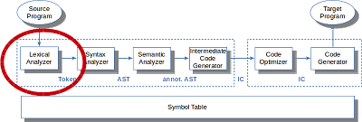

Der Lexer (auch "Scanner") soll den Zeichenstrom in eine Folge von Token
zerlegen. Zur Spezifikation der Token werden reguläre Ausdrücke verwendet.
Diese können über verschiedene Schritte in einen zugehörigen DFA transformiert
werden, der wiederum über Tabellen dargestellt werden kann (vgl. auch
["Reguläre Sprachen, Ausdrucksstärke"]()).

Mit Hilfe der (üblicherweise von Scanner-Generatoren generierten) Tabellen kann
ein Lexer implementiert werden ("tabellenbasierte Implementierung"). Zur Steigerung
der Effizienz kann die Tabelle in den Code integriert werden (etwa mit Sprungbefehlen,
"direkt codierte Implementierung"). Diese Lexer sind nur schwer nachvollziehbar und
werden üblicherweise generiert (vgl. ["Flex"]()
und ["ANTLR"]()).

Von Hand implementierte Lexer arbeiten üblicherweise rekursiv und verarbeiten immer
das nächste Zeichen im Eingabestrom. Die Arbeitsweise erinnert an LL-Parser (vgl.
["LL-Parser"]()).

Lexer müssen sehr effizient sein, da sie noch direkt auf der niedrigsten Abstraktionsstufe
arbeiten und u.U. oft durchlaufen werden. Deshalb setzt man hier gern spezielle Techniken
wie Puffern von Zeichen über einen Doppel-Puffer oder die Vermeidung von zuviel Roll-Back
ein.

Die Palette an Fehlerbehandlungsstrategien im Lexer reichen von "aufgeben" über den "Panic
Mode" ("gobbeln" von Zeichen, bis wieder eines passt) und Ein-Schritt-Transformationen bis
hin zu speziellen Lexer-Regeln, die beispielsweise besonders häufige Typos abfangen.
