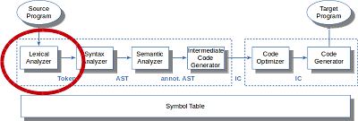

Der Lexer (auch "Scanner") soll den Zeichenstrom in eine Folge von Token
zerlegen. Zur Spezifikation der Token werden reguläre Ausdrücke verwendet.
Diese können über verschiedene Schritte in einen zugehörigen DFA transformiert
werden, der wiederum über Tabellen dargestellt werden kann (vgl. auch
`["Reguläre Sprachen, Ausdrucksstärke"]()`{=markdown}).

Mit Hilfe der (üblicherweise von Scanner-Generatoren generierten) Tabellen kann
ein Lexer implementiert werden ("tabellenbasierte Implementierung"). Zur Steigerung
der Effizienz kann die Tabelle in den Code integriert werden (etwa mit Sprungbefehlen,
"direkt codierte Implementierung"). Diese Lexer sind nur schwer nachvollziehbar und
werden üblicherweise generiert (vgl. `["Flex"]()`{=markdown}
und `["ANTLR"]()`{=markdown}).
