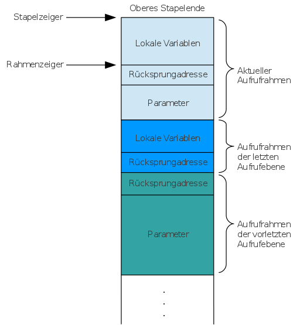

## Einordnung


[Quelle: [@Nystrom2021], [`Mountain.png`](https://github.com/munificent/craftinginterpreters/blob/master/site/image/a-map-of-the-territory/mountain.png), ([MIT](https://github.com/munificent/craftinginterpreters/blob/master/LICENSE))]{.origin}

::: notes
Die Erzeugung von Maschinencode ist ein "Parallelweg" zum Erzeugen von Bytecode. Die
Schwierigkeit liegt darin, die technischen Besonderheiten der Zielplattform (Register,
Maschinenbefehle) gut zu kennen und sinnvoll zu nutzen.

Häufig nutzt man hier den Drei-Adressen-Code als IR, der strukturell dem zu erzeugenden
Maschinencode bereits recht ähnlich ist. Oder man macht sich die Sache einfach und generiert
LLVM IR und lässt die LLVM-Toolchain übernehmen ;-)

Hier der Vollständigkeit halber ein Ausblick ...
:::


## Aufgaben bei der Erzeugung von Maschinen-Code

::: notes
Relativ ähnlich wie bei der Erzeugung von Bytecode, nur muss diesmal die Zielhardware
(Register, Maschinenbefehle, ...) beachtet werden:
:::

*   Übersetzen des Zwischencodes in Maschinenbefehle [für die jeweilige Zielhardware]{.notes}
*   Sammeln von Konstanten und Literalen am Ende vom Text-Segment

\smallskip

*   Auflösen von Adressen:
    *   Sprünge: relativ [(um wieviele Bytes soll gesprungen werden)]{.notes} oder absolut [(Adresse, zu der gesprungen werden soll)]{.notes}
    *   Strukturen (Arrays, Structs)[ haben ein Speicherlayout]{.notes}: Zugriff auf Elemente/Felder über Adresse [(muss berechnet werden)]{.notes}
    *   Zugriffe auf Konstanten oder Literalen: [Muss ersetzt werden durch]{.notes} Zugriff auf Text-Segment

\smallskip

*   Zuordnung der Variablen und Daten zu Registern oder Adressen
*   Aufruf von Funktionen: Anlegen der *Stack-Frames* [(auch *Activation Record* genannt)]{.notes}

\smallskip

*   Aufbau des Binärformats und Linking auf der Zielmaschine (auch Betriebssystem) beachten

## Übersetzen von Zwischencode in Maschinencode

::: notes
Für diese Aufgabe muss man den genauen Befehlssatz für den Zielprozessor kennen. Im einfachsten Fall kann man jede Zeile im Zwischencode mit Hilfe von Tabellen und Pattern Matching direkt in den passenden Maschinencode übertragen. Beispiel vgl. Tabelle 7.1 in [@Mogensen2017, S.162].

Je nach Architektur sind die Register, Adressen und Instruktionen 4 Bytes (32 Bit) oder 8 Bytes (64 Bit) "breit".

Da in einer Instruktion wie `ldr r0, x` die Adresse von `x` mit codiert ist, hat man hier nur einen eingeschränkten Wertebereich. Üblicherweise ist dies relativ zum *PC* zu betrachten, d.h. beispielsweise `ldr r0, #4[pc]` (4 Byte plus *PC*). Dadurch kann man mit *PC-relativer Adressierung*  dennoch größere Adressbereiche erreichen. Alternativ muss man mit indirekter Adressierung arbeiten und im Textsegment die Adresse der Variablen im Datensegment ablegen: `ldr r0, ax`, wobei `ax` eine mit *PC-relativer Adressierung* erreichbare Adresse im Textsegment ist, wo die Adresse der Variablen `x` im Datensegment hinterlegt ist. Anschließend kann man dann `x` laden: `ldr ro, [ro]`.

Ähnliches gilt für Konstanten: Wenn diese direkt geladen werden sollen, steht quasi nur der "Rest" vom Opcode zur Verfügung. Deshalb sammelt man die Konstanten am Ende vom Text-Segment und ruft sie von dort ab.
:::

```
L:  ...
    ...
    if t3 < v goto L
```

\pause
\bigskip

```
1000: ...                 // L
      ...
1080: LD      R1, t3      // R1 = t3
1088: LD      R2, v       // R2 = v
1096: SUB     R1, R1, R2  // R1 = R1-R2
1104: BLTZ    R1, 1000    // if R1<0 jump to 1000 (L)
```

*Anmerkung*: `1000` ist die Adresse, die dem Label `L` entspricht.

[Quelle: nach [@Aho2008]]{.origin}

## Aufruf von Funktionen: Anlegen eines *Stack-Frames*

::: center
{height="86%"}
:::

[Quelle:  [H3xc0d3r](https://commons.wikimedia.org/wiki/User:H3xc0d3r), [Aufrufstapel schema](https://commons.wikimedia.org/wiki/File:Aufrufstapel_schema.svg), [CC BY-SA 3.0](https://creativecommons.org/licenses/by-sa/3.0/legalcode)]{.origin}

::: notes
Ein Funktionsaufruf entspricht einem Sprung an die Stelle im Textsegment, wo der Funktionscode abgelegt ist. Dies erreicht man, in dem man diese Adresse in den *PC* schreibt. Bei einem `return` muss man wieder zum ursprünglichen Programmcode zurückspringen, weshalb man diese Adresse auf dem Stack hinterlegt.

Zusätzlich müssen Parameter für die Funktion auf dem Stack abgelegt werden, damit die Funktion auf diese zugreifen kann. Im Funktionscode greift man dann statt auf die Variablen auf die konkreten Adressen im Stack-Frame zu, diese sind je Funktion ja konstant (relativ zum *FP*).

Falls eine Funktion Rückgabewerte hat, werden diese ebenfalls auf dem Stack abgelegt (Überschreiben der ursprünglichen Parameter).

Zusammengefasst gibt es für jeden Funktionsaufruf die in der obigen Skizze dargestellte Struktur ("Stack Frame" oder auch "Activation Record" genannt):

*   Funktionsparameter (falls vorhanden)
*   Rücksprungadresse (d.h. aktueller *PC*)
*   Lokale Variablen der Funktion (falls vorhanden)

Der *FP* ("Rahmenzeiger" in der Skizze) zeigt dabei auf die Adresse des ersten Parameters, d.h. auf die Adresse *hinter* der Rücksprungadresse.

In der obigen Grafik sind drei Funktionsaufrufe aktiv: Die erste Funktion (türkis) hat Parameter, aber keine lokalen Variablen. Aus dieser Funktion heraus wurde eine zweite Funktion aufgerufen (blau). Diese hat keine Parameter, aber lokale Variablen. Die dort aufgerufene dritte Funktion (hellblau) hat sowohl Parameter als auch lokale Variablen.
:::

## Rücksprung aus einer Funktion

::: center
{height="86%"}
:::

[Quelle:  [H3xc0d3r](https://commons.wikimedia.org/wiki/User:H3xc0d3r), [Aufrufstapellayout nach Rücksprung](https://commons.wikimedia.org/wiki/File:Aufrufstapellayout_nach_R%C3%BCcksprung.svg), [CC BY-SA 3.0](https://creativecommons.org/licenses/by-sa/3.0/legalcode)]{.origin}

::: notes
Beim Rücksprung aus einer Funktion wird der Rückgabewert an die Stelle des ersten Parameters geschrieben und der restliche Stack freigegeben (lokale Variablen, Rücksprungadresse). Zusätzlich muss der *FP* für die vorige Funktionsebene gesetzt werden.
:::

## Freigabe des Rückgabewertes

::: center
{height="86%"}
:::

[Quelle: [H3xc0d3r](https://commons.wikimedia.org/wiki/User:H3xc0d3r), [Aufrufstapellayout nach Freigabe](https://commons.wikimedia.org/wiki/File:Aufrufstapellayout_nach_Freigabe.svg), [CC BY-SA 3.0](https://creativecommons.org/licenses/by-sa/3.0/legalcode)]{.origin}

::: notes
Nach Verarbeiten des Rückgabewertes wird auch dieser vom Stack entfernt (`pop`). 
Damit ist der Stack-Frame des letzten Funktionsaufrufs komplett vom Stack entfernt.
:::

## Beispiel: Modell-gesteuerte Übersetzung

```{.python size="scriptsize"}
class CodeGenerator(LucyVisitor):
    def __init__(self):
        self.types = { 'Void': ir.VoidType(), 'Int':  ir.IntType(32), }
        self.module  = ir.Module()
        self.symbols = SymbolTable()

    def new_block(self):
        block = self.func.append_basic_block(name='.entry')
        self.builder = ir.IRBuilder(block)

    def new_func(self, typ, ide):
        self.func = ir.Function(self.module, typ, name=ide)
        self.symbols.bind(ide, self.func)

    def new_var(self, typ, ide, val=None):
        ptr = self.builder.alloca(typ, name=ide)
        self.symbols.bind(ide, ptr)
        if val is not None: self.builder.store(val, ptr)
    ...

if __name__ == '__main__':
    print CodeGenerator().visit(parser.program()).module
```

::: notes
In diesem Beispiel wird die manuelle Erzeugung von Maschinencode vermieden. Stattdessen nutzt der Autor ein durch das Python-Modul `llvmlite` bereitgestelltes Modell, welches bei der Traversierung des AST mit Informationen befüllt wird und welches anschließend die Ausgabe des Zielcodes übernimmt.
:::

[Quelle: nach Andrea Orru (BSD 2, [github.com/AndreaOrru/Lucy](https://github.com/AndreaOrru/Lucy), [`lucyc.py`](https://github.com/AndreaOrru/Lucy/blob/master/compiler/lucyc.py#L34))]{.origin}

## Wrap-Up

Skizze zur Erzeugung von Assembler-Code

*   Relativ ähnlich wie die Erzeugung von Bytecode
*   Beachtung der Eigenschaften der Zielhardware (Register, Maschinenbefehle, ...)
    *   Übersetzen des Zwischencodes in Maschinenbefehle
    *   Sammeln von Konstanten und Literalen am Ende vom Text-Segment
    *   Auflösen von Adressen
    *   Zuordnung der Variablen und Daten zu Registern oder Adressen
    *   Aufruf von Funktionen: Anlegen der *Stack-Frames*


<!-- DO NOT REMOVE - THIS IS A LAST SLIDE TO INDICATE THE LICENSE AND POSSIBLE EXCEPTIONS (IMAGES, ...). -->
::: slides
## LICENSE


Unless otherwise noted, this work is licensed under CC BY-SA 4.0.

### Exceptions
*   TODO (what, where, license)
:::
