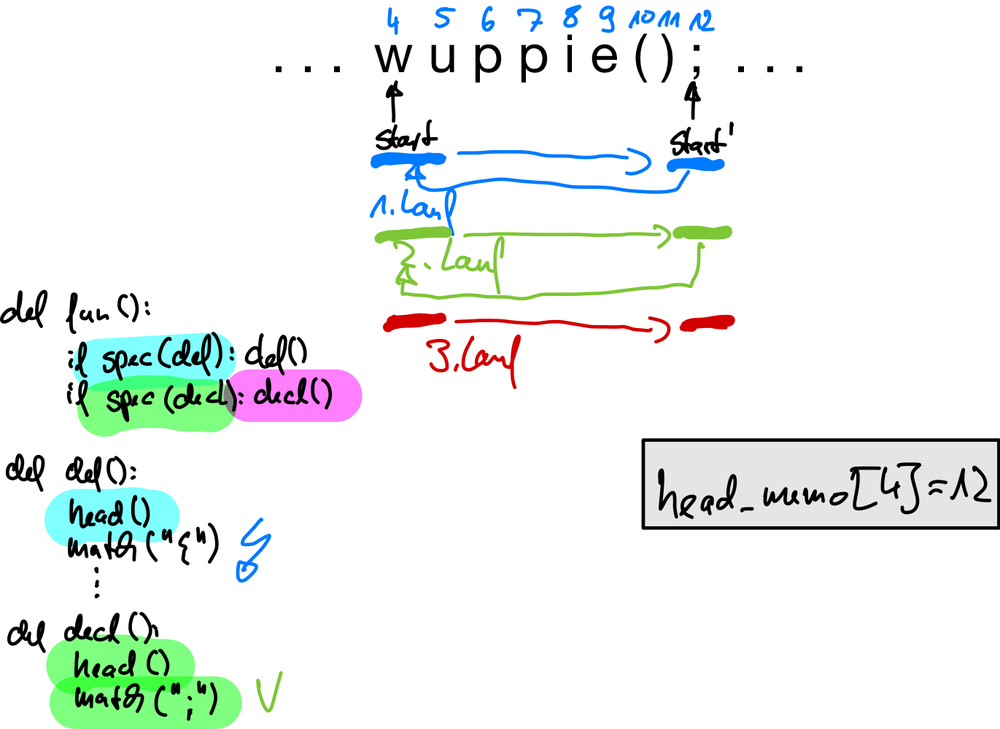

## LL-Parser mit Backtracking

[Problem: Manchmal kennt man den nötigen Lookahead nicht vorher. Beispiel:]{.notes}

```cpp
wuppie();         // Vorwärtsdeklaration
wuppie() { ...}   // Definition
```

[Entsprechend sähe die Grammatik aus:]{.notes}

```yacc
func : fdef | fdecl ;
fdef  : head '{' body '}' ;
fdecl : head ';' ;
head : ... ;
```

::: notes
Hier müsste man erst den gesamten Funktionskopf parsen, bevor man entscheiden kann, ob es sich um
eine Deklaration oder eine Definition handelt. Unglücklicherweise gibt es keine Längenbeschränkung
bei den Funktionsnamen ...

Mit Hilfe von Backtracking kann man zunächst spekulativ matchen und beim Auftreten eines Fehlers
die Spekulation rückgängig machen:
:::

\pause
\bigskip

```python
def func():
    if sfdef: fdef()      # Spekuliere auf "fdef"
    elif sfdecl: fdecl()  # Spekuliere auf "fdecl"
    else: raise Exception()
```

::: notes
Die erste Alternative, die passt, gewinnt. Über die Reihenfolge der Spekulationen kann man
entsprechend Vorrangregeln implementieren.


**Anmerkung**: Man könnte die obige Grammatik umformen und bräuchte dann kein spekulatives
Parsen mit Backtracking:

```yacc
func : head ('{' body '}' | ';') ;
head : ... ;
```

Da wir aber das Parsen mit Backtracking betrachten wollen, blenden wir diese Möglichkeit
jetzt einfach aus :)
:::


## Details: Spekulatives Matchen

```python
def sdecl():
    success = True

    mark()                  # markiere aktuelle Position

    try:   decl()           # probiere Regel decl
    catch: success = False

    clear()                 # Rollback

    return success
```

::: notes
Vor dem spekulativen Matchen muss die aktuelle Position im Tokenstrom markiert werden. Falls
der Versuch, die Deklaration zu matchen nicht funktioniert, wird `decl()` eine Exception werfen,
entsprechend wird die Hilfsvariable gesetzt. Anschließend muss noch mit `clear()` das aktuelle
Token wieder hergestellt werden (wir sind ja nur im Spekulationsmodus, d.h. selbst im Erfolgsfall
wird ja die Regel `decl()` noch aufgerufen).
:::


## Spekulatives Matchen: Hilfsmethoden I/II

```python
class Parser:
    Lexer lexer
    Stack<INT> markers     # Integer-Stack: speichere Tokenpositionen
    List<Token> lookahead  # Puffer (1 Token vorbefüllt via Konstruktor)
    int start = 0          # aktuelle Tokenposition im lookahead-Puffer

    def mark():
        markers.push(start)

    def clear():
        start = markers.pop()
```


## Spekulatives Matchen: Hilfsmethoden II/II

```python
def consume():
    ++start
    if start == lookahead.count() and markers.isEmpty():
        start = 0; lookahead.clear()
    sync(1)

def lookahead(i):
    sync(i)
    return lookahead.get(start+i-1)

def sync(i):
    n = start + i - lookahead.count()
    if n > 0:
        for (i=0; i<n; i++):
            lookahead.add(lexer.nextToken())
```

::: notes
`consume` holt wie immer das nächste Token, hier indem der Index `start` weiter gesetzt
wird und ein weiteres Token über `sync` in den Puffer geladen wird. Falls wir nicht am
Spekulieren sind und das Ende des Puffers erreicht haben, nutzen wir die Gelegenheit und
setzen den Puffer zurück. (Dies geht nicht, wenn wir spekulieren -- hier müssen wir ja
ggf. ein Rollback vornehmen und benötigen also den aktuellen Puffer dann noch.)

Die Funktion `sync` stellt sicher, dass ab der Position `start` noch `i` unverbrauchte
Token im Puffer sind.

**Hinweis**: Die Methode `count` liefert die Anzahl der aktuell gespeicherten Elemente
in `lookahead` zurück (nicht die Gesamtzahl der Plätze in der Liste -- diese kann größer
sein). Mit der Methode `add` wird ein Element hinten an die Liste angefügt, dabei wird
das Token auf den nächsten Index-Platz (`count`) geschrieben und ggf. die Liste automatisch
um weitere Speicherplätze ergänzt. Über `clear` werden die Elemente in der Liste gelöscht,
aber der Speicherplatz erhalten (d.h. `count()` liefert den Wert 0, aber ein `add` müsste
nicht erst die Liste mit weiteren Plätzen erweitern, sondern könnte direkt an Index 0 das
Token schreiben).
:::

[Tafel: Beispiel mit dynamisch wachsendem Puffer]{.bsp}

::: notes
Backtracking führt zu Problemen:

1.  Backtracking kann _sehr_ langsam sein (Ausprobieren vieler Alternativen)
2.  Der spekulative Match muss ggf. rückgängig gemacht werden
3.  Man muss bereits gematchte Strukturen erneut matchen (=> Abhilfe: Packrat-Parsing)
:::


## Verbesserung Backtracking: Packrat Parser (Memoizing)

```yacc
stat :  list EOF  |  list '=' list  ;
```

::: notes
Bei Eingabe `[a,b]=[c,d]` wird zunächst spekulativ die erste Alternative untersucht und
eine `list` gematcht. Da die Alternative nicht komplett passt, muss die Spekulation
rückgängig gemacht werden und die zweite Alternative untersucht werden. Dabei muss man
den selben Input erneut auf `list` matchen!

Idee: Wenn `list` sich merken würde, ob damit ein bestimmter Teil des Tokenstroms bereits
behandelt wurde (erfolgreich oder nicht), könnte man das Spekulieren effizienter gestalten.
Jede Regel muss also durch eine passende Regel mit Speicherung ergänzt werden.

*Anmerkung*: Mit `EOF` kann man ANTLR-Parser zwingen, den kompletten Eingabestrom zu betrachten.

https://en.wikipedia.org/wiki/Memoization
https://en.wikipedia.org/wiki/Parsing_expression_grammar#Implementing_parsers_from_parsing_expression_grammars
:::

\pause

::: center
{width="60%"}
:::


## Details zum Packrat-Parsing

``` {.python size="scriptsize"}
Map<INT, INT> list_memo

def _list():  # Original List-Methode (umbenannt)
    match(LBRACK); elements(); match(RBRACK);

def list():   # Ersatz-Methode mit Packrat-Parsing
    failed = False
    s = start
    if markers.isNotEmpty() and alreadyParsed(list_memo): return
    try: _list()  # nicht am Spekulieren oder noch nicht untersucht
    catch(e): failed = True; raise e
    finally:
        if markers.isNotEmpty(): memoize(list_memo, s, failed)
```

::: notes
*   Wenn am Spekulieren und bereits untersucht: Direkt zurückkehren (und Vorspulen)
*   Sonst Original-Regel ausführen
*   Exception: Regel hatte keinen Erfolg; merken und Exception weiter reichen
*   Falls wir am Spekulieren sind: Ergebnis für diese Startposition und diese Regel merken
:::

``` {.python size="scriptsize"}
def memoize(memo, s, failed):
    stop = failed ? -1 : start
    memo.put(s, stop)

def alreadyParsed(memo):
    i = memo.get(start)
    if i == null: return False
    if i == -1: raise Exception()
    start = i  # Vorspulen
    return True
```

::: notes
*   `memoize` wird nach dem Test der Regel aufgerufen (im spekulativen Modus)
    *   Falls Regel erfolgreich, dann wird die Start-Position und die aktuelle Position
        (Stopp-Position) notiert
    *   Falls Regel nicht erfolgreich, wird als Stopp-Position der Wert `-1` genutzt

*   `alreadyParsed` wird im spekulativen Fall vor dem (erneuten) Test einer Regel aufgerufen
    *   Falls aktuelle Position noch nicht in der Tabelle, dann wurde die Regel offenbar noch
        nicht getestet (an dieser Position)
    *   Falls für die aktuelle Position eine `-1` in der Tabelle steht, wurde die Regel bereits
        an dieser Position getestet, aber nicht erfolgreich. Dies würde wieder der Fall sein,
        also kann man direkt eine Exception auslösen
    *   Anderenfalls wurde für die aktuelle Startposition die Regel bereits erfolgreich getestet
        (aber die Spekulation passte nicht), also wird einfach "vorgespult", d.h. `start` auf die
        vermerkte Endposition gesetzt.


**Anmerkung**: Die Funktion `consume()` muss passend ergänzt werden: Falls der Parser nicht
(mehr) spekuliert, d.h. der `markers`-Stack leer ist, müssen alle `*_memo` zurückgesetzt werden!

```python
def consume():
    ++start
    if start == lookahead.count() and markers.isEmpty():
        start = 0
        lookahead.clear()
        clearAllMemos()  # leere alle "regel"_memo-Maps
    sync(1)
```
:::


## Semantische Prädikate

Problem in Java: `enum` ab Java5 Schlüsselwort [(vorher als Identifier-Name verwendbar)]{.notes}

```yacc
prog : (enumDecl | stat) ;
stat : ... ;

enumDecl : ENUM id '{' id (',' id)* '}' ;
```

::: notes
Wie kann ich eine Grammatik bauen, die sowohl für Java5 und später als auch für die Vorgänger
von Java5 funktioniert?

Angenommen, man hätte eine Hilfsfunktion ("Prädikat"), mit denen man aus dem Kontext heraus
die Unterscheidung treffen kann, dann würde die Umsetzung der Regel ungefähr so aussehen:
:::

\bigskip
\pause

```python
def prog():
    if lookahead(1) == ENUM and java5: enumDecl()
    else: stat()
```


## Semantische Prädikate in ANTLR

::: notes
### Semantische Prädikate in Parser-Regeln
:::

```yacc
@parser::members {public static boolean java5;}

prog : ({java5}? enumDecl | stat)+ ;
stat : ... ;

enumDecl : ENUM id '{' id (',' id)* '}' ;
```

::: notes
Prädikate aktivieren bzw. deaktivieren alles, was nach der Abfrage des Prädikats gematcht
werden könnte. Entsprechend könnte man die obige Formulierung auch so schreiben:

Wichtig ist hierbei nur, dass das Prädikat ausgewertet wird, bevor ein "`enum`"-Token im
Eingabestrom auftritt.


### Semantische Prädikate in Lexer-Regeln

Alternativ für Lexer-Regeln:
:::

```yacc
ENUM : 'enum' {java5}? ;
ID   : [a-zA-Z]+ ;
```

::: notes
Bei Token kommt das Prädikat erst am rechten Ende einer Lexer-Regel vor, da der Lexer keine
Vorhersage macht, sondern nach dem längsten Match sucht und die Entscheidung erst trifft,
wenn das ganze Token gesehen wurde. Bei Parser-Regeln steht das Prädikat links vor der
entsprechenden Alternative, da der Parser mit Hilfe des Lookaheads Vorhersagen trifft, welche
Regel/Alternative zutrifft.

*Anmerkung*: Hier wurden nur Variablen eingesetzt, es können aber auch Methoden/Funktionen
genutzt werden. In Verbindung mit einer Symboltabelle (["Symboltabellen"](cb_symboltabellen1.html))
und/oder mit Attributen und Aktionen in der Grammatik (["Attribute"](cb_attribute.html) und
["Interpreter: Attribute+Aktionen"](cb_interpreter2.html)) hat man hier ein mächtiges Hilfswerkzeug!
:::


## Wrap-Up

*   LL(1) und LL(k): Erweiterungen
    *   Dynamischer Lookahead: BT-Parser mit Packrat-Ergänzung
    *   Semantische Prädikate zum Abschalten von Alternativen


<!-- DO NOT REMOVE - THIS IS A LAST SLIDE TO INDICATE THE LICENSE AND POSSIBLE EXCEPTIONS (IMAGES, ...). -->
::: slides
## LICENSE


Unless otherwise noted, this work is licensed under CC BY-SA 4.0.

### Exceptions
*   TODO (what, where, license)
:::
