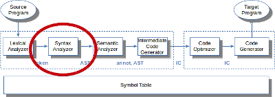

LL-Parsern können direkt aus einer Grammatik implementiert werden: Zu jeder Produktionsregel
erstellt man eine gleichnamige Funktion. Wenn in der Produktionsregel andere Regeln "aufgerufen"
werden, erfolgt in der Funktion an dieser Stelle der entsprechende Funktionsaufruf. Bei
Terminalsymbolen wird das erwartete Token geprüft.

Dabei findet man wie bereits im Lexer die Funktionen `match` und `consume`, die sich hier aber
auf den Tokenstrom beziehen. LL(1)-Parser schauen dabei immer das nächste Token an, LL(k) haben
ein entsprechendes Look-Ahead von $k$ Token. Dies kann man mit einem Ringpuffer für die Token
realisieren.

Zur Beachtung der Vorrang- und Assoziativitätsregeln muss die Grammatik entsprechend umgebaut
werden. LL-Parser haben durch die Betrachtung des aktuellen Vorschau-Tokens ein Problem mit
Linksrekursion in der Grammatik, diese muss zunächst beseitigt werden. (ANTLR bietet hier gewisse
Vereinfachungen an, kann aber mit indirekter Linksrekursion auch nicht umgehen.)
