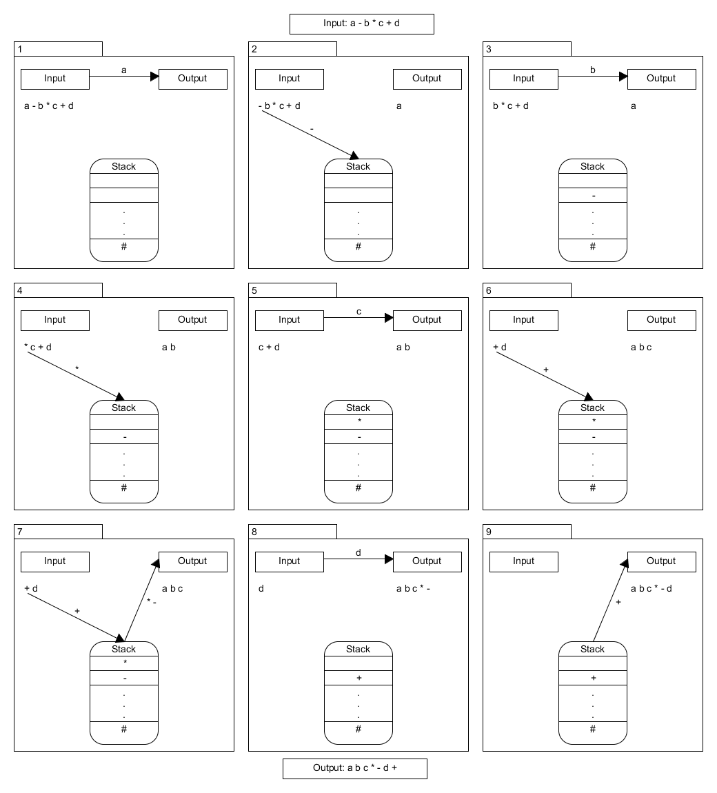

# PEG Parser

## Generative Systeme vs Recognition basierte Systeme

- Generative Systeme:
    - formale Definition von Sprachen durch Regeln, die rekursive
      angewendet Sätze/Strings der Sprache generieren
    - Sprachen aus der Chomsky Hierarchie definiert durch
      kontextfreie Grammatiken (CFGs) und reguläre Ausdrücke (REs)

- Recognition basierte Systeme:
    - Sprachen definiert in Form von Regeln/Prädikaten, die
      entscheiden ob ein gegebener String Teil der Sprache ist
    - Parsing Expression Grammar (PEG)


## Beispiel:

Sprache $L = \lbrace \varepsilon,\, \mathrm{aa},\, \mathrm{aaaa},\, \ldots \rbrace$:

- generativ:   $L =\lbrace s \in \mathrm{a}^{\ast} \mid s = (\mathrm{aa})^{n},\, n \geq 0\rbrace$

- recognition: $L = \lbrace s \in \mathrm{a}^{\ast} \mid \left| s \right| \mod 2 = 0 \rbrace$


## Motivation (1/2)

Chomsky (CFGs + REs):

- ursprünglich für natürliche Sprachen
- adaptiert für maschinenorientierte Sprachen (Eleganz, Ausdrucksstärke)
- Nachteile:
    - maschinenorientierte Sprachen sollten präzise und eindeutig sein
    - CFGs erlauben mehrdeutige Syntax (gut für natürliche Sprachen)
    - Mehrdeutigkeiten schwer oder gar nicht zu verhindern
        - C++ Syntax
        - Lambda abstractions, `let` expressions und conditionals in Haskell
    - generelles Parsen nur in super-linearer Zeit

## Motivation (2/2)
PEG:

- Stilistisch ähnlich zu CFGs mit REs (EBNF)

- **Kernunterschied**: priorisierender Auswahloperator (`/` statt `|`)
    - Alternative Muster werden der Reihe nach getestet
    - erste passende Alternative wird verwendet
    - Mehrdeutigkeiten werden dadurch unmöglich
    - nähe an der Funktionsweise von Parsern (Erkennen von Eingaben)
        - PEGs können als formale Beschreibung eines Top-Down-Parsers betrachtet werden

- Beispiel:
    - EBNF: $A \rightarrow a\;b\; |\; a$ und $A \rightarrow a\; |\; a\; b$ sind äquivalent
    - PEG: $A \leftarrow a\;b\; /\; a$ und $A \leftarrow a\; /\; a\; b$ sind verschieden

## Definition PEG

Eine Parsing Expression Grammar (PEG) ist ein 4-Tuple $G = (V_N, V_T, R, e_S)$ mit

- $V_N$ eine endliche Menge von Nicht-Terminalen
- $V_T$ eine endliche Menge von Terminalen
- $R$ eine endliche Menge von Regeln
- $e_S$ eine *Parsing Expression*, die als *Start Expression*
  bezeichnet wird.

Weiterhin gilt:

- $V_N \cap V_T = \emptyset$.
- jede Regel $e \in R$ ist ein Paar $(A,e)$ geschrieben als $A \leftarrow e$ mit $A \in V_N$ und $e$ eine **Parsing Expression**
- für jedes Nicht-Terminal $A$ existierte genau ein $e$ mit $A \leftarrow e \in R$.

## Definition Parsing Expression
**Parsing Expressions** werden rekursiv definiert: Seien $e$, $e_1$ und $e_2$ Parsing Expressions, dann gilt dies auch für

- den leeren String $\varepsilon$
- jedes Terminal $a \in V_T$
- jedes Nicht-Terminal $A \in V_N$
- die Sequenz $e_1 e_2$
- die priorisierte Option $e_1 / e_2$
- beliebige Wiederholungen $e^{\ast}$
- Nicht-Pradikate $!e$

## Operatoren für Parsing Expression

Folgende Operatoren sind für die Konstruktion von **Parsing Expressions** erlaubt:

| Operator | Priorität | Beschreibung           |
|:--------:|:---------:|:-----------------------|
| ' '      |     5     | String-Literal         |
| " "      |     5     | String-Literal         |
| [ ]      |     5     | Zeichenklasse          |
| .        |     5     | belibieges Zeichen     |
| (e)      |     5     | Gruppierung            |
| e?       |     4     | Optional               |
| e*       |     4     | Kein-oder-mehr         |
| e+       |     4     | Ein-oder-mehr          |
| &e       |     3     | Und-Prädikat           |
| !e       |     3     | Nicht-Prädikat         |
| e1 e2    |     2     | Sequenz                |
| e1 / e2  |     1     | priorisierende Auswahl |

:::notes
Die Operatoren `.`, `+`, `?` und `&` sind syntaktischer Zucker und lassen sich auf ander Operatoren zurückführen.

Die Operatoren `!` und `&` sind zentral für die Ausdrücksstärke von PEGs

Beispiel: `&e` versucht das Muster `e` zu erkennen und kehrt dann an den Anfangspunkt zurück ohne Zeichen aus dem Eingabestrom zu verbrauchen.
Nur das Wissen über Erfolg oder Miserfolg wird gespeichert (siehe Beispiel zu Nicht-CFG-Sprachen).
:::

## PEG Eigenschaften

- wahrscheinlich andere Sprachklasse als CFGs

:::notes
    - PEGs können alle deterministischen LR(k)-Sprachen darstellen
    - PEGs können manche nicht-CFG Sprachen darstellen (z.B. $a^n b^n c^n$)
    - ungelöste Frage: Sind alle CFGs durch PEGs darstellbar?
:::

- parsebar in linearer Zeit mit unbegrenztem Lookahead (Packrat
  Parsing)
    - Nachteil: gesamter zu parsender Text muss im Speicher gehalten werden

:::notes
    - Speicherplatz ist heute aber keine große Einschränkung mehr
    - Quellcode-Dateien sind meist nur im KB-Bereich
:::

- neue Möglichkeiten für das Syntax-Design von Sprachen

:::notes
    - aber auch neue Möglichkeiten für Fehler durch Unachtsamkeit
:::

- Syntaxbeschreibung: keine Unterscheidung zwischen Hierarchie und
  lexikalischen Elementen nötig

:::notes
    - für gewöhnlich Hierarchie durch CFG und lex. Elem. durch RE beschrieben
        - CFGs ungeeignet für lex. Elemente (keine Greedy-Matching, keine 'negative' Syntax)
        - REs: keine rekursive Syntax
    - Tokens können hierarchische Eigenschaften haben (verschachtelte Kommentare)
    - beliebige Escape-Sequenzen möglich
:::

- Herausforderung bei PEGs:
    - sind Alternativen vertauschbar ohne die Sprache zu ändern?
    - Analog zur Frage der Mehrdeutihkeit bei CFGs

## Beispiel: Formeln

```
Expr   <- Term ([-+] Term)*
Term   <- Factor ([*/] Factor)*
Factor <- '(' Expr ')' / [0-9]+
```

Achtung: Grammatik ist rechtsassoziativ

## Beispiel: Verschachtelte Kommentare

Verschachtelte Kommentare sind möglich, da die lexikalische Syntax von PEGs nicht auf REs beschränkt ist:

```
Comment       <- CommentStart CommentBody* CommentEnd
CommentStart  <- '/*'
CommentEnd    <- '*/'
CommentBody   <- Comment / (!CommentEnd AnySingleChar)
AnySingleChar <- .
```

oder in Kurzform

```
Comment <- '/*' (Comment / !'*/' .)* '*/'
```

## Beispiel: Beliebige Escape-Sequenzen
Escape-Sequenzen haben meist nur eine stark eingeschränkte Syntax. Eine PEG kann beliebige Ausdrücke in eine Escape-Sequenz erlauben:

```
Expression <- ...
Primary    <- Literal / ...
Literal    <- ["] (!["] Char)* ["]
Char       <- '\\(' Expression ')'
            / !'\\' .
```

Zum Beispiel könnte man dadurch in einer Escape-Sequenz auf Variablen zugreifen: `\(var)`.

## Beispiel: Verschachtelte Template Typen in C++

Bekanntes Problem mit Template-Definitionen in C++: Leerzeichen zwischen Winkelklammern nötig um Interpretation als Pipe-Operator (`>>`) zu verhindern:
```
TypeA<TypeB<TypeC> > MyVar;
```

PEG erlaubt kontextsensitive Interpretation:
```
TemplType <- PrimType (LANGLE TemplType RANGLE)?
ShiftExpr <- PrimExpr (ShiftOper PrimExpr)*
ShiftOper <- LSHIFT / RSHIFT
        
LANGLE    <- '<' Spacing
RANGLE    <- '>' Spacing
LSHIFT    <- '<<' Spacing
RSHIFT    <- '>>' Spacing
```

## Beispiel: Dangling-Else

In CFGs sind verschachtelte if-then(-else) Ausdrücke mehrdeutig
(Shift-Reduce-Konflikt). Dies wird häufig durch informelle Meta-Regeln
oder Erweiterung der Syntax aufgelöst. In PEGs sorgt der prioriserende
Auswahloperator für das korrekte Verhalten.

```
Statement <- IF Cond THEN Statement ELSE Statement
           / IF Cond THEN Statement
           / ...
```

## Beispiel: Nicht-CFG-Sprachen

Ein klassisches Beispiel einer nicht-CFG Sprache ist $a^n b^n c^n$. Diese Sprache lässt sich mit der folgenden PEG darstellen:

$G = (\lbrace A,B,S \rbrace, \lbrace a,b,c \rbrace, R, S)$

$A \leftarrow a\;A\;b\; /\; \varepsilon$

$B \leftarrow b\;B\;c\; /\; \varepsilon$

$S \leftarrow \& (A\; !b)\; a^{\ast}\; B\; !.$

:::notes
Regel S lässt sich dabei wie folgt lesen: Erkenne und Verbrauche eine beliebig lange Sequenz von a's ($a^{\ast}$) gefolgt von einer Sequenz, die von Regel B erkannt wird und danach keine weiteren Zeichen hat ($!.$) aber nur dann wenn die Sequenz auch von durch $A\; !b$ erkannt wird. Der erste Teil trifft zu wenn in der Sequenz auf $n$ b's gleich viele c's folgen während der zweite Teil zutrifft wenn $n$ b's auf $n$ a's folgen.
:::


# Operator Precedence Parsing

## Motivation

-   Probleme mit [CFG und BNF](https://matklad.github.io/2020/04/13/simple-but-powerful-pratt-parsing.html)
-   [Recursive Decent Parser](https://eli.thegreenplace.net/2008/09/26/recursive-descent-ll-and-predictive-parsers/) (RD)
    -   Modelliere Grammatik(-regeln) durch rekursive Funktionen
    -   top-down Ansatz
    -   i.d.R. LL(1) Parser (handgeschrieben)
    -   Generatoren: [ANTLR](http://www.antlr.org/), [Boost.Spirit](http://spirit.sourceforge.net/)
-   [Probleme](https://eli.thegreenplace.net/2009/03/14/some-problems-of-recursive-descent-parsers/) mit RD
    -   Linksrekursion (für handgeschriebene Parser von gringer
        Bedeutung; Ersetzbar durch Schleife, EBNF)
    -   Vorrangregeln (Precedence/Binding Power) und Assoziativität
        von Operatoren
    -   Effizienz (Backtracking)

## Eigenschaften

-   Recognition basiert (insofern das der Parser nicht aus einer
    Grammatik generiert sondern von Hand geschrieben wird)
-   Verwendet Vorschautoken
-   benutzt sowohl Rekursion als auch Schleifen
-   Interpretiert [Operator-Precedence Grammatik](https://en.wikipedia.org/wiki/Operator-precedence_grammar)
    -   Untermenge der deterministischen kontextfreien Grammatiken
-   Simple zu Programmieren und kann die Operator-Tabelle während der Programmlaufzeit konsultieren
- Verwendet eine Reihenfolge(precedence) für die Operatoren

##  Klassische Methode (RD)

-   siehe [Parsing Expressions by Recursive Descent](https://www.engr.mun.ca/~theo/Misc/exp_parsing.htm)
-   neues Nicht-Terminal für jeden Precedence-Level
-   Nachteile:
	-   Anzahl der Precedence Level bestimmt Größe und Geschwindigkeit des Parsers
	-   Operatoren und Precedence Levels fest in Grammatik eingebaut

## Dijkstras Shunting Yard Algorithmus (SY)

::: notes

   - Verwendet Stacks für Operatoren und Argumente anstatt Rekursion

::: 

{width="50%"}

## Dijkstras Shunting Yard Algorithmus-Beispiel
```
    while there are tokens to be read:
         read a token
         if the token is a number:
           output.add(token)
         if the token is an operator:
           if operator is a bracket:
           	if left bracket:
           		stack.put(token)
           	else:
           		check if left bracket is in stack
           		while stack.top != left bracket:
           			output.add(stack.pop())	
           		output.add(stack.pop())	 // pop left bracket
           else:
              if token.precedence < stack.top.precedence:
                  output.add(stack.pop())        
              stack.put(token)
```

## Precedence Climbing (PC)

   - Climb **down** the precedence levels (Norvell)

   - Behandelt eine Expression wie verschachtelte Unterausdrücke

        - Jeder Unterausdruck enthält das gemeinsame precedence level

```
  2 + 3 * 4 * 5 - 6
  
  |---------------|   : prec 1
      |-------|       : prec 2
```

 - Die Operatoren stehen mit Gewicht und Association (left, right) in einer Tabelle

   

## Precedence Climbing-Beispiel

```
  compute_expr(min_prec):
    result = compute_atom()    // Atom is a number or a expression in brackets
    curtoken = next()	
    while curtoken precedence > min_prec:
      prec, assoc = precedence and associativity of current token
      if assoc is left:
        next_min_prec = prec + 1
      else:
        next_min_prec = prec
      rhs = compute_expr(next_min_prec)
      result = compute operator(result, rhs)
  
    return result
```

::: notes

```
  6 + 3 * 4
```

```
    * compute_expr(1)
    	* compute_atom() --> 6
    	* compute_expr(2) 					# Loop with '+' left assoc
    		* compute_atom() --> 3
    		* compute_expr(3)				# Loop with '*' left assoc
    			* compute_atom() --> 4
          		* result --> 4	 			# Loop not enterd '+ < *'
            * result = 3 * 4 --> 12
        * result = 6 + 12 --> 18 
```

* Beispiel: [Parsing expressions by precedence climbing](https://eli.thegreenplace.net/2012/08/02/parsing-expressions-by-precedence-climbing) (Python)

:::

## Top Down Operator Precedence (TDOP) Pratt Parsing

   - Generalisierung von Precedence Climbing

   - Verwendet eine Gewichtung (binding Power) statt einer Reihenfolge (precedence)

     - lbp = left Binding Power
     - rbp= Right Binding Power

## Tokenhandler
   - Die Tokenhandler behandeln Notationen unterschiedlich

     - infix notation: a = b - c

       - led (left denotation)

     - prefix from: a = -b

       - nud (Null denotation)

```
  class operator_sub_token(object):
      lbp = 10
      def nud(self):
          return -expression(100)
      def led(self, left):
          return left - expression(10)
          
  class operator_mul_token(object):
      lbp = 20
      def led(self, left):
          return left * expression(20)
```

::: notes
 - hat eine Tokenhandler für jede Operation

   - operator_add_token, operator_mul_token, operator_sub_token, operator_pow_token
- operator_lparen_token, operator_rparen_token
:::

## Top Down Operator Precedence-Beispiel

```
     def expression(rbp=0):
         global token
         t = token
         token = next()
         left = t.nud()
         while rbp < token.lbp:  # TERMINATION CONDITION
             t = token
             token = next()
             left = t.led(left)  # results in recursive call
         return left     
```
::: notes
- Beispiel: [Top-Down operator precedence parsing](https://eli.thegreenplace.net/2010/01/02/top-down-operator-precedence-parsing/) (Python)
:::

## Right Associative TDOP

-   Der Parser behandelt die folgende Potenzierungsoperatoren als Unterausdrücke des ersten Unterausdruck
-   Dies wird erreicht, indem wir den Ausdruck im Handler der Potenzierung mit einem rbp aufrufen, der niedriger ist als der lbp der Potenzierung

```
class operator_pow_token(object):
    lbp = 30
    def led(self, left):
       return left ** expression(30 - 1)  # RECURSIVE CALL
```

   - Wenn expression zum nächsten ^ in seiner Schleife gelangt, stellt er fest, dass noch rbp < token.lbp ist und gibt das Ergebnis nicht sofort zurück, sondern sammelt zunächst den Wert des Unterausdrucks.

## Vergleich

-   Shunting Yard, TDOP und Precedence Climbing sind im
    wesentlichen der gleiche Algorithmus:
-   Im Gegensatz zum klassichen RD ist das Hinzufügen/Ändern von
    Operatoren einfach
    -   RD: Hinzufügen/Ändern von Funktionen im Parser
    -   SY/TDOP/PC: Daten liegen in Tabellenform vor
-   Mischformen möglich (siehe Shunting Yard in [Parsing Expressions by Recursive Descent](https://www.engr.mun.ca/~theo/Misc/exp_parsing.htm))
-   Shunting Yard verwendet einen Stack anstatt Rekrusive 
-   Precedence Climbing wird am häufigsten eingesetzt

## Vergleich TDOP vs. Precedence Climbing
-   TDOP(Pratt Parsing) vs. Precedence Climbing
    -   [Pratt Parsing and Precedence Climbing Are the Same Algorithm](https://www.oilshell.org/blog/2016/11/01.html)
    -   [From Precedence Climbing to Pratt Parsing](https://www.engr.mun.ca/~theo/Misc/pratt_parsing.htm) (Norvell)
    -   Eine While Schleife mit rekursiven Aufruf mit Abbruchbedingung (binding Power/precedence)
    -   Rechts Assoziativität 
        -   In precedence climbing: next_min_prec = prec + 1 für left Assoziativität 
        -   In Pratt Parsing: rechte binding power rbp auf lbp-1 gesetzt und der rekursive Aufruf mit ihr durchgeführt
    -   Klammern
        -   In precedence climbing in der rekursiven Parsing Funktion behandelt 
        -   In Pratt Parsing können sie als nud-Funktion für das Token ( behandelt werden

## Anwendung

-   [Haskell](https://en.wikipedia.org/wiki/Haskell_(programming_language))
    -   Benutzerdefinierte Infix-Operatoren mit individueller
        Assoziativität und Vorrang-Regeln
    -   Ein Beispiel für das konsultieren der Operator während der Laufzeit
-   [Raku](https://en.wikipedia.org/wiki/Raku_(programming_language))
    -   im Verbund mit zwei weiteren Parsern (Speed-up beim Parsen von
        arithmetischen Ausdrücken)
-   Taschenrechner
    -   Umwandlung Infix-Notation (menschenlesbar) in umgekehrte
        polnische Notation (optimiert für Auswertung)

## Weitere Links

-   [Introduction to Pratt parsing and its terminology](https://abarker.github.io/typped/pratt_parsing_intro.html) (Python [typped](https://github.com/abarker/typped)
    Dokumentation)
-   [Pratt Parsers: Expression Parsing Made Easy](http://journal.stuffwithstuff.com/2011/03/19/pratt-parsers-expression-parsing-made-easy/) (Java)
-   [Top Down Operator Precedence](http://crockford.com/javascript/tdop/tdop.html) (JavaScript)
-   [Operator-precedence parser](https://en.wikipedia.org/wiki/Operator-precedence_parser) (Wikipedia)
-   [Pratt Parsing Index and Updates](https://www.oilshell.org/blog/2017/03/31.html) (Sammlung von Artikeln/Posts)
-   [Simple but Powerful Pratt Parsing](https://matklad.github.io/2020/04/13/simple-but-powerful-pratt-parsing.html) (Rust)
-   [Precedence Climbing is Widely Used](http://www.oilshell.org/blog/2017/03/30.html)
-   [Shunting-yard algorithm](https://en.wikipedia.org/wiki/Shunting_yard_algorithm) (Wikipedia)
-   [Pratt Parsing and Precedence Climbing Are the Same Algorithm](https://www.oilshell.org/blog/2016/11/01.html)
-   Beispiel: [A recursive descent parser with an infix expression evaluator](https://eli.thegreenplace.net/2009/03/20/a-recursive-descent-parser-with-an-infix-expression-evaluator) (Python)

# Parser Kombinatoren

## Prinzip 

+ High-order Funktion
  + Funktionen als Parameter
  + Funktion als Rückgabewert
  + Programmiersprachen mit first-class functions
+ Verwendet mehrere Parser als Input und gibt einen Kombinierten Parser output als Rückgabewert zurück
  + parse Tree
  + Index der Stelle im String die zum Stoppen des Parsers geführt hat
+ Die Output der verwendeten Parser:
  + Success: {result, restString}
  + failure: Error Message und Position

## Simple Parser

Simple Parser, die nachher als Inputparameter für einen Kombinierten Parser verwendet werden.

```
// Simple Integer Parser
function integer(input) {
  // note we removed $ from the end of the regular expression
  const match = /^\d+/.exec(input);
  if (match != null) {
    const matchedText = match[0];
    return success(+matchedText, input.slice(matchedText.length));
  }
  return failure("an integer", input);
}

```
::: notes
```
// Simple plus operator Parser
function plus(input) {
  if (input[0] === "+") {
    return success("+", input.slice(1));
  }
  return failure("'+'", input);
}

// Simple endofLine Parser
function eof(input) {
  if (input.length === 0) return success(null, input);
  return failure("end of input", input);
}
```
:::

## Kombinierter Parser

Der Kombinierte Parser sieht wie folgt aus:

```
// Combined Parser
function apply(func, parsers) {
  return function applyParser(input) {
    const accData = [];
    let currentInput = input;

    for (const parser of parsers) {
      const result = parser(currentInput);
      if (result.isFailure) return result;
      accData.push(result.data);
      currentInput = result.rest;
    }

    return success(func(...accData), currentInput);
  };
}
```
::: notes
Nun kann über den Parameter func eine Funktionsweise angegeben werden und über den Parameter parsers kann ein Array an Simpleren Parsern übergeben werden. Die Parser müssen dabei in der richtigen Reihenfolge aufgerufen werden. In der Variable accData werden alle Parser Ergebnisse gespeichert, um sie nachher in der der func zu verwenden. Der currentInput enthält im ersten druchlauf den gesamten Input. Jeder Parser schreibt dann den Rest (der nicht parsbare Teil) in die currentInput für den nächsten Parser. 
:::

## Kombinierte Parser definieren
Der Kombinierte Parser kann nun so definiert werden:

```
const plusExpr = apply((num1, _, num2) => num1 + num2, [
  integer,
  plus,
  integer,
  eof
]);
```

Diese Zusammensetzung der Parser überprüft eine plus expression mit Integern. Wichtig hierbei ist die richtige Reihenfolge der Parser.

## Verwendung der Parsers

Nun muss noch eine parse Funktion geschrieben werden, um die Kombinierten Parser auszuführen.

```
// And for our main parsing, we'll invoke this function
function parse(parser, input) {
  const result = parser(input);
  if (result.isFailure) {
    throw new Error(`Parse error.
		expected ${result.expected}.
		instead found '${result.actual}'
	`);
  } else {
    return result;
  }
}

```

## Ausführung des Kombinierten Parsers

Führt man nun den Parser aus kann es wie folgt aussehen.
```
parse(plusExpr, "12+34")
  >> {data: 46, rest: ""}
  
parse(plusExpr, "12+34rest")
  >> Uncaught Error: Parse error.
		expected end of input.
		instead found 'rest'
```


## Links

-   [Wiki](https://en.wikipedia.org/wiki/Parser_combinator)
-   [Parser Combinators: a Walkthrough](https://hasura.io/blog/parser-combinators-walkthrough/)
- 	[Introduction to parser combinators](https://gist.github.com/yelouafi/556e5159e869952335e01f6b473c4ec1)


<!-- DO NOT REMOVE - THIS IS A LAST SLIDE TO INDICATE THE LICENSE AND POSSIBLE EXCEPTIONS (IMAGES, ...). -->
::: slides
## LICENSE


Unless otherwise noted, this work is licensed under CC BY-SA 4.0.

### Exceptions
*   TODO (what, where, license)
:::
