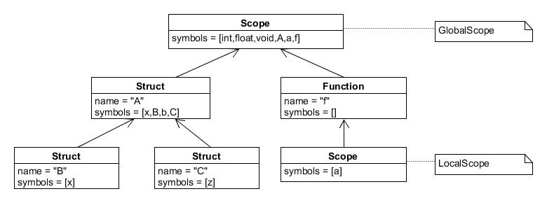
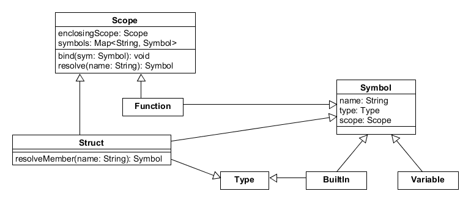
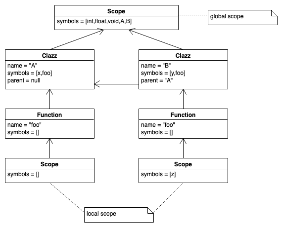
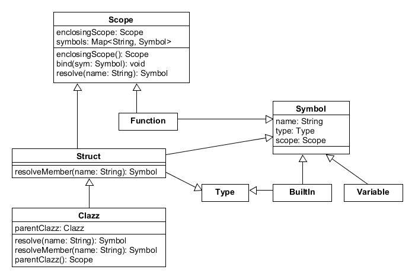

## Strukturen

:::::: columns
::: {.column width="32%"}

```c
struct A {
    int x;
    struct B {int x;};
    B b;
    struct C {int z;};
};
A a;
void f() {
    A a;
    a.b.x = 42;
}
```

:::
::: {.column width="68%"}

\pause



:::
::::::

[Quelle: nach [@Parr2010, S.156]]{.origin}


## Strukturen: Erweiterung der Symbole und Scopes



::: notes
Strukturen stellen wie Funktionen sowohl einen Scope als auch ein Symbol dar.
Deshalb lohnt es sich, den gemeinsamen Code in die Zwischenklasse `ScopedSymbol`
auszulagern.

Zusätzlich stellt eine Struktur (-definition) aber auch einen neuen Typ
dar, weshalb `Struct` auch noch das Interface `Type` "implementiert".

**Anmerkung**: In der Klasse `Symbol` ist noch ein Feld `scope` vom Typ `Scope`
hinzugekommen. Damit "weiss" jedes Symbol, in welchem Scope es bekannt ist und
man muss sich auf der Suche nach dem Scope eines Symbols ggf. nicht erst durch
die Baumstruktur hangeln. Aus technischer Sicht verhindert das Attribut das
Aufräumen eines lokalen Scopes durch den Garbage Collector, wenn man den lokalen
Scope wieder verlässt: Jeder Scope hat eine Referenz auf den umgebenden (Eltern-)
Scope (Feld `enclosingScope`). Wenn man den aktuellen Scope "nach oben" verlässt,
würde der eben verlassene lokale Scope bei nächster Gelegenheit aufgeräumt, wenn
es keine weiteren Referenzen auf diesen gäbe. Da nun aber die Symbole, die in
diesem Scope definiert wurden, auf diesen verweisen, passiert das nicht :)

Entsprechend muss man die `bind()`-Methode ergänzen:

```python
def bind(symbol):
    symbols[symbol.name] = symbol
    symbol.scope = self     # track the scope in each symbol
```
:::


## Strukturen: Auflösen von Namen

```python
class Struct(Scope, Symbol, Type):
    def resolveMember(name):
        return symbols[name]
```
\bigskip

=> Auflösen von "`a.b`"[\ (im Listener in `exitMember()`)]{.notes}:

*   `a` im "normalen" Modus mit `resolve()` über den aktuellen Scope
*   Typ von `a` ist `Struct` mit Verweis auf den eigenen Scope
*   `b` nur innerhalb des Struktur-Scopes mit `resolveMember()`

\bigskip
\bigskip

::::::::: slides
:::::: columns
::: {.column width="13%"}
``` {.c size="tiny"}
struct A {
    int b;
};
void f() {
    A a;
    a.b = 42;
}
```
:::
::: {.column width="33%"}

:::
::: {.column width="54%"}

:::
::::::
:::::::::


## Klassen

:::::: columns
::: {.column width="32%"}

```cpp
class A {
public:
    int x;
    void foo() { ; }
};
class B : public A {
public
    int y;
    void foo() {
        int z = x+y;
    }
};
```

:::
::: {.column width="58%"}

\pause



:::
::::::

[Quelle: nach [@Parr2010, S.159]]{.origin}


## Klassen: Erweiterung der Symbole und Scopes



::: notes
Bei Klassen kommt in den Tabellen ein weiterer Pointer `parent` auf die Elternklasse
hinzu (in der Superklasse ist der Wert `null`).
:::

## Klassen: Auflösen von Namen

``` python
class Clazz(Struct):
    Clazz parent # None if base class

    def resolve(name):
        # do we know "name" here?
        s = symbols[name]
        if (s != None) return s
        # NEW: if not here, check any parent class ...
        if (parent != None) return parent.resolve(name)
        # ... or enclosing scope if base class
        if (enclosingScope != None) return enclosingScope.resolve(name)
        return None # not found

    def resolveMember(name):
        s = symbols[name]
        if (s != None) return s
        # NEW: check parent class
        if (parent != None) return parent.resolveMember(name)
        return None
```

::: notes
Beim Auflösen von Attributen oder Methoden muss zunächst in der Klasse selbst gesucht werden,
anschließend in der Elternklasse.

Beispiel (mit den obigen Klassen `A` und `B`):

```cpp
B foo;
foo.x = 42;
```

Hier wird analog zu den Structs zuerst `foo` mit `resolve()` im lokalen Scope aufgelöst. Der Typ
des Symbols `foo` ist ein `Clazz`, was zugleich ein Scope ist. In diesem Scope wird nun mit
`resolveMember()` nach dem Symbol `x` gesucht. Falls es hier nicht gefunden werden kann, wird in
der Elternklasse (sofern vorhanden) weiter mit`resolveMember()` gesucht.


Die normale Namensauflösung wird ebenfalls erweitert um die Auflösung in der Elternklasse.

Beispiel:

```cpp
int wuppie;
class A {
public:
    int x;
    void foo() { ; }
};
class B : public A {
public
    int y;
    void foo() {
        int z = x+y+wuppie;
    }
};
```

Hier würde `wuppie` als Symbol im globalen Scope definiert werden. Beim Verarbeiten von
`int z = x+y+wuppie;` würde mit `resolve()` nach `wuppie` gesucht: Zuerst im lokalen Scope
unterhalb der Funktion, dann im Funktions-Scope, dann im Klassen-Scope von `B`. Hier sucht
`resolve()` auch zunächst lokal, geht dann aber die Vererbungshierarchie entlang (sofern
vorhanden). Erst in der Superklasse (wenn der `parent`-Zeiger `null` ist), löst `resolve()`
wieder normal auf und sucht um umgebenden Scope. Auf diese Weise kann man wie gezeigt in
Klassen (Methoden) auf globale Variablen verweisen ...


*Anmerkung*: Durch dieses Vorgehen wird im Prinzip in Methoden aus dem Zugriff auf ein Feld
`x` implizit ein `this.x` aufgelöst, wobei `this` die Klasse auflöst und `x` als Attribut darin.
:::


## Wrap-Up

*   Symboltabellen: Verwaltung von Symbolen und Typen (Informationen über Bezeichner)

\smallskip

*   Strukturen und Klassen bilden eigenen Scope
*   Strukturen/Klassen lösen etwas anders auf: Zugriff auf Attribute und Methoden


<!-- DO NOT REMOVE - THIS IS A LAST SLIDE TO INDICATE THE LICENSE AND POSSIBLE EXCEPTIONS (IMAGES, ...). -->
::: slides
## LICENSE


Unless otherwise noted, this work is licensed under CC BY-SA 4.0.

### Exceptions
*   TODO (what, where, license)
:::
