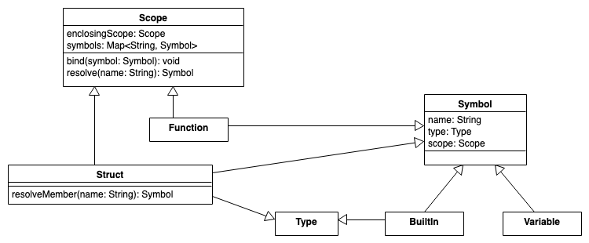
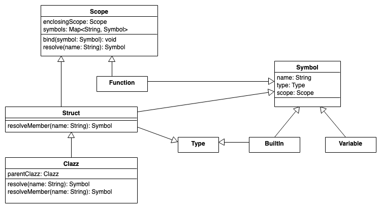

## Inhalt




```python
def bind(symbol):
    symbols[symbol.name] = symbol
    symbol.scope = self # track the scope in each symbol
```

```python
class Struct(Scope, Symbol, Type): 
    def resolveMember(name):
        return symbols[name]
```




``` python
class Clazz(Struct):
  	Clazz parent # None if base class

    def resolve(name):
        # do we know "name" here?
        s = symbols[name]
        if (s != None) return s
        # NEW: if not here, check any parent class ...
        if (parent != None) return parent.resolve(name)
        # ... or enclosing scope if base class
        if (enclosingScope != None) return enclosingScope.resolve(name)
        return None # not found
    
    def resolveMember(name):
        s = symbols[name]
        if (s != None) return s
        # NEW: check parent class
        if (parent != None) return parent.resolveMember(name)
        return None
```

## Motivation

Lorem Ipsum. Starte mit H2-Level.
...

**TODO** 


<!-- DO NOT REMOVE - THIS IS A LAST SLIDE TO INDICATE THE LICENSE AND POSSIBLE EXCEPTIONS (IMAGES, ...). -->
::: slides
## LICENSE


Unless otherwise noted, this work is licensed under CC BY-SA 4.0.

### Exceptions
*   TODO (what, where, license)
:::
