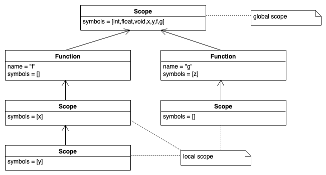

**TODO** 

* Texte anpassen für die Überschriften
  * Funktionen sind Symbole *und* Scopes

## Funktionen und Scopes

:::::: columns
::: {.column width="36%"}

\vspace{4mm}

```c
int x = 42;
int y;
void f() {
    int x;
    x = 1;
    y = 2;
    { int y = x; }
}
void g(int z){}
```

:::
::: {.column width="64%"}

\pause



:::
::::::

### Behandlung von Funktionsdefinitionen

*   Jeder Symboltabelleneintrag braucht ein Feld, das angibt, ob es sich um eine
    Variable, eine Funktion, ... handelt. Alternativ eine eigene Klasse ableiten ...
*   Der Name der Funktion steht als Bezeichner in der Symboltabelle des Scopes, in dem
    die Funktion definiert wird.
*   Der Symboltabelleneintrag für den Funktionsnamen enthält Verweise auf die Parameter.
*   Der Symboltabelleneintrag für den Funktionsnamen enthält Angaben über den Rückgabetypen.
*   Jede Funktion wird grundsätzlich wie ein neuer Scope behandelt.
*   Die formalen Parameter werden als Einträge in der Symboltabelle für den Scope der
    Funktion angelegt and entsprechend als Parameter gekennzeichnet.


### Behandlung von Funktionsaufrufen

*   Der Name der Funktion steht als Bezeichner in der Symboltabelle des Scopes, in dem
    die Funktion aufgerufen wird und wird als Aufruf gekennzeichnet.
*   Der Symboltabelleneintrag für den Funktionsnamen enthält Verweise auf die aktuellen
    Parameter.
*   Die Definition der Funktion wird in den zugänglichen Scopes gesucht (wie oben) und
    ein Verweis darauf in der Symboltabelle gespeichert.
    :::


## Erweiterung des Klassendiagramms für Funktions-Scopes


## Funktionen sind Symbole *und* Scopes

``` python
class Function(Scope, Symbol):
    def __init__(name, retType, enclosingScope):
        Symbol.__init__(name, retType) 		# we are "Symbol" ...
        enclosingScope = enclosingScope 	# ... and "Scope"
```

::: notes
Im Grunde ist die Implementierung von `resolve()` *exakt* die aus `BaseScope`.
Da man in Java nur von einer Klasse erben kann (und `FunctionSymbol` bereits
von `Symbol` erbt), bleibt das unschöne Nebeneinander.

Alternativ könnte man die Implementierung von `resolve()` ab Java8 auch in
das Interface `Scope` schreiben und müsste dann statt des Zugriffs auf die
Attribute `symbols` und `enclosingScope` entsprechend Hilfsmethoden
aufrufen, da Interfaces keinen Zustand haben ...
:::

## Funktionen: Listener

::: notes
Den Listener zum Aufbau der Scopes könnte man entsprechend erweitern:

*   `enterFuncDecl`:
    *   löse den Typ der Funktion im aktuellen Scope auf
    *   lege neues Funktionssymbol an, wobei der aktuelle Scope der Elternscope ist
    *   definiere das Funktionssymbol im aktuellen Scope
    *   ersetze den aktuellen Scope durch das Funktionssymbol
*   `exitFuncDecl`:
    *   ersetze den aktuellen Scope durch dessen Elternscope
*   `exitParam`: analog zu `exitVarDecl`
    *   löse den Typ der Variablen im aktuellen Scope auf
    *   definiere ein neues Variablensymbol im aktuellen Scope
*   `exitCall`: analog zu `exitVar`
    *   löse das Funktionssymbol (und die Argumente) im aktuellen Scope auf 

:::

:::::: columns
::: {.column width="38%"}

\vspace{4mm}

``` {.yacc size="footnotesize"}
funcDecl
    :   type ID '(' params? ')'
        block
    ;
params
    :   param (',' param)*
    ;
param
    :   type ID
    ;

call:   ID '(' exprList? ')'
    ;
exprList : expr (',' expr)* ;
```

[Relevanter Ausschnitt aus der Grammatik]{.notes}
:::
::: {.column width="62%"}

\vspace{-2mm}

``` {.python size="footnotesize"}
def enterFuncDecl(CParser.FuncDeclContext ctx):
    def name = ctx.ID().getText()
    def type = scope.resolve(ctx.type().getText())
    def func = Function(name, type, scope)
    scope.bind(func)
    scope = func # current scope is now function scope

def exitFuncDecl(CParser.FuncDeclContext ctx):
    scope = scope.getEnclosingScope()
def exitParam(CParser.ParamContext ctx):
    def t = scope.resolve(ctx.type().getText())
    def var = Variable(ctx.ID().getText(), t)
    scope.bind(var)

def exitCall(CParser.CallContext ctx):
    def name = ctx.ID().getText()
    def func = scope.resolve(name)
    if (func == null):
        error("no such function: " + name)
    if (func instanceof Variable):
        error(name + " is not a function")
```

[*Anmerkung*: Um den Code auf die Folie zu bekommen, ist dies wieder ein Mix aus Java und Python geworden. Sry ;)]{.notes}
:::
::::::

::: notes
Im Vergleich zu den einfachen *nested scopes* kommt hier nur ein weiterer
Scope für den Funktionskopf dazu. Dieser spielt eine Doppelrolle: Er ist
sowohl ein Symbol (welches im Elternscope bekannt ist) als auch ein eigener
(lokaler) Scope für die Funktionsparameter.

Um später im Interpreter eine Funktion tatsächlich auswerten zu können, muss
im Scope der Funktion zusätzlich der AST-Knoten der Funktionsdefinition
gespeichert werden (weiteres Feld/Attribut in `Function`)!
:::


## Wrap-Up

*   Symboltabellen: Verwaltung von Symbolen und Typen (Informationen über Bezeichner)
    *   Funktionen: Nested Scopes \blueArrow hierarchische Organisation
    *   Umgang mit dem Funktionsnamen, den Parametern und dem Funktionskörper


<!-- DO NOT REMOVE - THIS IS A LAST SLIDE TO INDICATE THE LICENSE AND POSSIBLE EXCEPTIONS (IMAGES, ...). -->
::: slides
## LICENSE


Unless otherwise noted, this work is licensed under CC BY-SA 4.0.

### Exceptions
*   TODO (what, where, license)
:::
